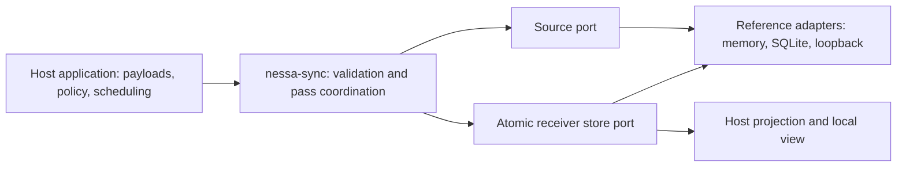

# Nessa Sync Engine

`nessa-sync` is a reusable Rust library for moving committed data into local
caches. An app reads its cache immediately, even when its source is unreachable;
when connected, it fetches bounded changes from each receiver's saved progress.
The library keeps payload meaning, authorization policy, scheduling, and agent
execution in the host application.

**Status:** six reference slices are implemented and checked in this repository's
CI. The crate is unpublished (`publish = false`). The loopback network adapter
and example credentials are for local development. There is no Nessa gateway or
mobile integration, production pairing, encrypted relay, or production service
availability claim yet.

## What is implemented

| Capability | Implemented reference path | Verify |
| --- | --- | --- |
| Ordered immutable records | Exact source/scope identity, bounded pages, finite catch-up, atomic apply and checkpoint; two independent in-memory receivers | `./scripts/verify-slice-1` |
| Durable records | SQLite source and receiver, restart recovery, transaction rollback and immutable ID checks | `python3 scripts/verify-slice-2.py` |
| Network recovery | Loopback-only framed transport, authorized source reads, wake hints, fallback checks and fault injection | `python3 scripts/verify-slice-3.py` |
| Two host applications | Transcript and task-board views over the same core, with local browser reads and separate freshness state | `python3 scripts/verify-slice-4.py` |
| Long transcript history | Bounded recent tail, separate live and older-history positions, coalesced older reads, reset generations and deletion fences | `python3 scripts/verify-slice-5.py` |
| Changing catalogues | Current entries with per-entry revisions, retained deletion markers and finite resumable passes | `python3 scripts/verify-slice-6.py` |

Each command runs from the repository root and exits nonzero on failure. CI runs
all six. The optional weak-link profiles are available with
`python3 scripts/verify-slice-3.py --profiles`.

## How it fits together



The host calls `begin_pass` and drives bounded record pages. The source assigns
committed positions; each receiver saves its own checkpoint with the applied
records. A wake hint only asks the host to check again. Lost hints are recovered
by reconnect and host-scheduled head checks. Opening a cached view does not
fetch its unchanged record payload. Head checks, authentication, hints and
connection maintenance still use network bytes.

Transcript history and a changing list have **different progress**. A long
transcript can start with a small recent tail and load older records on demand
without rewinding its live head. A catalogue pages current entries in stable
creation order through a captured revision boundary; edits made during the pass
are discovered by the next pass. The [walkthrough](docs/design/core-walkthrough.md)
and [detailed slice notes](docs/implementation-plan.md) show the sequences and
failure cases.

## Use the examples

Start with the default-feature, two-receiver lab:

```sh
./scripts/verify-slice-1
```

For a local transcript stored across process restarts, run:

```sh
python3 scripts/verify-slice-2.py
```

The [transcript and task-board example](docs/design/example-apps.md) has a
loopback source, two cached receivers and local browser views. The
[history lab](docs/design/tail-history.md) exercises networked tail and older
reads. The [catalogue lab](docs/design/catalogue-pass.md) runs transcript-list
and task-list host modes against separate local SQLite source and receiver
files; catalogue transport over the loopback wire is not implemented. Its byte
counters are logical metadata and payload sizes, not measured wire bytes.

The default build needs no SQLite or socket dependency. `sqlite` adds local
reference storage. `transport` includes `sqlite` and adds the loopback-only
network adapter. The crate requires Rust 1.85 or newer.

## Boundaries and next work

The source and receiver adapters are reference implementations. They demonstrate
specific transaction, restart and loopback fault behavior; they do not prove
power-loss recovery, backup consistency, mobile background execution, or remote
security. An unchanged stream sends no new **record payload** in the examples;
it can still require a small head check. Data that a receiver has not cached
must be transferred when requested.

Nessa can later adapt committed [event-stream](https://github.com/nessalabs/event-stream)
reads to the `RecordSource` port. This repository does not depend on that crate
or use it as the sync protocol. Nessa must also supply its canonical record
fold, conversation catalogue, current authorization, pairing, command receipts,
artifact policy and backup/restore before a linked phone can safely control an
agent. The [ADR](docs/adr/1-reusable-local-first-sync-engine.md) and
[product target contract](docs/design/sync-engine.md) describe that broader
direction; their unimplemented requirements are not guarantees of this crate.

The next standalone slice is [catalogue pages over the bounded loopback
transport](https://github.com/nessalabs/sync-engine/issues/18). [Artifact
synchronization](https://github.com/nessalabs/sync-engine/issues/19) has its own
parent issue and linked contract, transfer, and Nessa adapter tasks. The Nessa
product work is grouped under [linked-device reads](https://github.com/nessalabs/nessa-agent/issues/257),
[pairing and connectivity](https://github.com/nessalabs/nessa-agent/issues/263),
[remote commands](https://github.com/nessalabs/nessa-agent/issues/267), and
[backup and restore](https://github.com/nessalabs/nessa-agent/issues/270).

## Development and CI

```sh
cargo fmt --all -- --check
cargo clippy --locked --all-features --all-targets -- -D warnings
cargo test --locked --no-default-features --all-targets
cargo test --locked --all-features --all-targets
cargo test --locked --all-features --doc
RUSTDOCFLAGS="-D warnings" cargo doc --locked --all-features --no-deps
cargo +1.85.0 check --locked --all-features --all-targets
```

CI runs these checks plus the six labs on source changes. A Markdown-only pull
request runs the path-classification test and skips Rust setup and checks.
The repository has its own workflow and build cache; a Nessa integration would
pin a reviewed core revision and test its own adapter. See
[CONTRIBUTING.md](CONTRIBUTING.md) before making changes.
