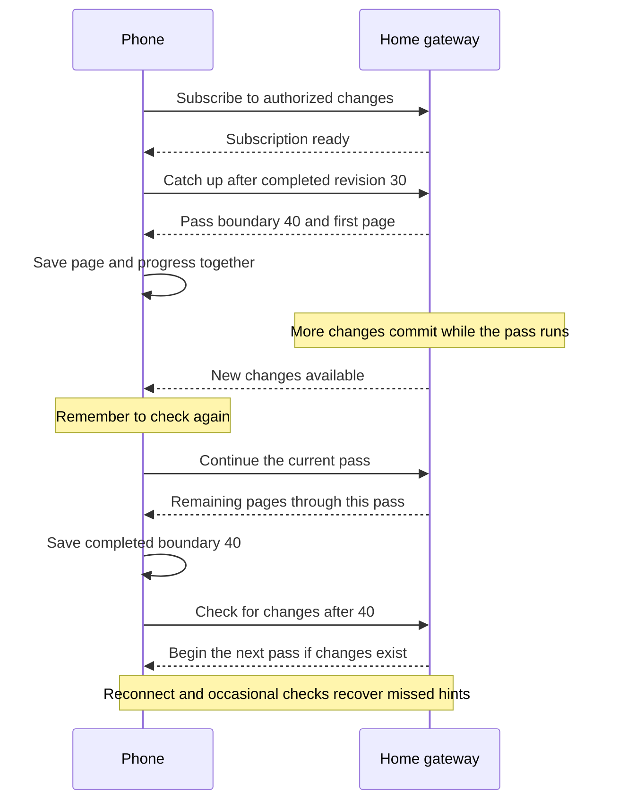

# 1. Synchronize local-first conversations through a reusable record engine

## Purpose

A linked phone can read a home gateway's conversation list, saved transcript, and agent state, then send prompts and controls to that gateway over an intermittent, low-bandwidth connection. The sync mechanism is a reusable Rust crate for agent applications; Nessa supplies conversation meaning, authorization, and execution routing at its boundary. [Linear's local database, sync-action log, and checkpointed catch-up](https://linear.app/now/rebuilding-delta-sync-read-path) informed the design, while Nessa must also work without a hosted account or continuously reachable server.

- **Date:** 2026-09-28
- **Status:** proposed
- **Issue:** [#1](https://github.com/nessalabs/sync-engine/issues/1)
- **Moved from:** Nessa ADR 247 and [nessa-agent#247](https://github.com/nessalabs/nessa-agent/issues/247), now closed as moved.
- **Contract:** [sync engine design](../design/sync-engine.md)
- **Related:** [0008 — agent execution](https://github.com/nessalabs/nessa-agent/blob/main/docs/adr/todo/0008-agent-client-api.md), [0009 — event-stream integration](https://github.com/nessalabs/nessa-agent/blob/main/docs/adr/todo/0009-reusable-event-stream-crate.md), [0011 — authorized conversation delivery](https://github.com/nessalabs/nessa-agent/blob/main/docs/adr/todo/0011-nessa-session-protocol-and-authorities.md)

**Implementation status:** the independent core's seven [reference slices](../implementation-plan.md)
are implemented and tested. They cover record replication, SQLite restart,
loopback recovery, two example views, bounded history, local catalogue passes,
and bounded loopback catalogue transport. This ADR remains **proposed for Nessa product integration**:
Nessa storage, pairing, authorization, command, mobile and backup contracts
below are not implemented by the standalone crate. Catalogue pages use the
loopback wire only in a separate development lab.

## Context

Nessa currently keeps conversation ownership and summaries in gateway SQLite, while the SDK saves execution history and receipts in separate JSONL journals. The desktop reads bounded replacement views; their revisions cannot resume a missed transcript gap. A phone also needs an authorized remote command path and a local read cache. Syncing raw databases, provider processes, or file paths would couple devices to Nessa internals and would not give a safe command or recovery contract.

The first delivery covers conversation identity, list state, saved transcript, visible agent milestones, command receipts, and prompt/Stop. File contents and multi-gateway writes to one conversation are outside this delivery. Each conversation has one authoritative SDK coordinator reached through its gateway. Another device may observe it or ask that coordinator to act; applying a copied record does not execute an action. ADR 0009's canonical local record store and SDK migration are prerequisites, rather than work owned by this decision. The [storage transition prerequisite in ADR 0008](https://github.com/nessalabs/nessa-agent/blob/main/docs/adr/todo/0008-agent-client-api.md#one-durable-record-source) retains metadata authority for this first slice; moving that authority later requires revising this catalogue/deletion design before implementation.

## Decision

1. **Create a separate `nessa-sync` Rust crate.** Its domain models replica/stream identities, dense record positions, checkpoints, snapshots, and receiver delivery/apply states. Its application layer coordinates bounded remote catch-up, coalesced wakeups, retry, deduplication, and atomic apply/checkpoint through injected ports. Storage, transport, clock, and authorization decisions enter through those ports. It imports no Nessa conversation, provider, auth, UI, or `/session` types. Nessa adapters map conversation facts and current grants to the crate. ADR 0009's `event-stream` adapter remains the owner of local store append and replay-then-live; this crate consumes its committed reads without reimplementing that local algorithm.
2. **Sync transcript records and changes to current conversation-list entries.** Transcript streams have contiguous positions and stable origin/incarnation/schema identities. Receivers atomically save applied data and progress. The catalogue includes archived and unsummarized owned conversations, with creation/change revisions over current metadata and retained deletion markers. A pass captures a fixed boundary, finishes its pages despite concurrent edits, saves its completed boundary, then checks for newer changes. It may contain current entry values newer than that boundary; it does not represent every entry at one exact instant. There is no per-device history of summary payloads. The [catalogue contract](../design/sync-engine.md#catalogue-passes-finish-the-current-work-then-check-again) defines stable paging, conditional payload reads, atomic page progress and deletion handling. The open transcript bootstraps from a bounded tail with older pages on demand. ADR 0009 must give gateway, snapshot builder and phone one shared Rust fold over canonical records, replacing the current live-event view fold. Stale deliveries cannot bypass checked reset generations, entry revisions or deletion fences.
3. **Keep execution and policy with their owners.** The gateway checks current authorization and routes commands to the authoritative SDK coordinator, which serializes admission and saves stable receipts before dispatch. Delivery batches are separately reauthorized. The [portable runtime direction](https://github.com/nessalabs/nessa-agent/issues/252) distinguishes the coordinator from any local or remote worker. A linked phone is a device credential of its owner's principal with separately revocable grants on the exact gateway resource; existing domain ownership checks decide which conversations belong to that principal. Commands retain the owner's `createdByPrincipalId` and audit the device initiator. Before phone support, migrate the current `requestId` plus `executionId` send contract to ADR 0008's single mutation ID, with a durable `requestId` to `turnId` receipt mapping. The phone saves that immutable intent before first send. A new read-only SDK/gateway receipt lookup scoped to principal, operation and target must never admit work. Bounded retries may continue while the original foreground send is active; after restart/backgrounding, an unaccepted old intent needs explicit foreground retry. Stop names the captured `turnId` and requires ADR 0008's turn-interrupt operation, which is not yet implemented; today's attachment-wide close is not its substitute. Independently accepted queued work remains under its own request identity. The sync crate transports committed facts but does not admit prompts, run agents, merge text, or define roles.
4. **Use the existing auth owner for device trust.** The gateway creates a one-use, expiring invitation shown as a QR code; the linked device generates its own keypair and receives a scoped grant after approval. A short manually typed code requires a reviewed PAKE. Device identity and grant transitions extend the existing auth registry, rather than creating another registry. Direct local connectivity and an optional outbound relay carry the same authenticated protocol. The first relay only forwards to an online gateway; serving retained data while the gateway is offline requires a separate revocation and authenticity decision. This explicitly advances ADR 0011's deferred cross-device trust scope.
5. **Keep backup separate from sync.** ADR 0009's canonical semantic record source owns accepted input, transcript, milestones, and receipts after its SDK journal migration; gateway metadata owns identity, access, and deletion until explicitly moved. This decision adds a proposed sync extension to ADR 182's deletion lifecycle. An online consistent export needs a new reversible lease in the existing admission owner; current permanent retirement cannot provide one. A restored gateway gets a new replica identity and device key, stays quarantined until tombstones and backup freshness are reconciled, and never reruns historical commands. A retained deletion inventory proves only the deletes it contains; if the lost source could have unuploaded deletes, the product requires an explicit rollback decision rather than silently republishing old data.

6. **Use notifications to trigger catch-up, with recovery checks.** The normal follow path sends a small server hint after committed changes; the client fetches after its saved progress. Hints coalesce during an active pass and do not restart it. Subscribe before initial catch-up, check the head before waiting, and check again on app open, foreground resume and reconnection. Occasional active head checks recover missed hints; failures back off with jitter. Polling and keepalive intervals depend on measured latency, battery and data cost. The weak-link spike compares this baseline with bounded direct streaming for an active transcript and long polling. All delivery strategies use the same authorization, atomic apply, checkpoint and backpressure contracts. Transport selection does not alter which data is durable.

The [contract document](../design/sync-engine.md) defines the state/order tables, wire and port requirements, failure semantics, and validation gates for these decisions. Proposed parameters such as batch size, compression, and transport preference are selected by weak-link spikes, not fixed in this ADR.

## How catch-up works

In the intended Nessa integration, a phone shows saved conversations while its
home gateway runs the agent. A canonical local record source will save transcript
facts; Nessa adapters will supply ownership and conversation meaning to the
reusable engine. The reference apps already show cached reads and catch-up, but
they do not use Nessa's records or dispatch commands. Receiving copied records
does not execute commands.

For example, a phone has completed catalogue revision 30 and begins a pass with boundary 40. If the gateway changes again while the phone downloads, the phone finishes the current pass, saves 40, then checks what is newer. Entry values may already reflect newer changes, so 40 is a completed pass boundary rather than a promise that all previews show the same instant. Intermediate preview versions need not be transferred. Transcript records retain their separate ordered history.

Notifications make updates prompt; durable progress makes missed notifications recoverable. [Replicache uses notifications with fallback polling](https://v12.doc.replicache.dev/concepts/faq). [CouchDB offers polling, long polling and continuous feeds](https://docs.couchdb.org/en/stable/api/database/changes.html). These are established delivery patterns; the catalogue paging algorithm remains subject to its own validation.

| Delivery strategy | Behavior | Role in this design |
| --- | --- | --- |
| Notify, then fetch | Server sends a hint, client requests committed changes after saved progress | Baseline, with reconnect checks and occasional fallback checks |
| Stream committed batches | Client subscribes from saved progress and server delivers bounded batches directly | Compare for active transcripts to avoid an extra fetch round trip per update |
| Long polling | Client asks for changes and server waits for a change or timeout before answering | Alternative adapter to compare on weak connections |

The engine requires bounded data and durable progress regardless of transport. It does not require all three strategies to ship. The [detailed contract](../design/sync-engine.md#live-delivery-and-recovery-from-missed-notifications) owns ordering and recovery behavior.

## Alternatives considered

- **Replicate SQLite/JSONL files between devices:** couples clients to process-private layouts, cannot atomically cover the current stores, and does not distinguish replayed history from commands.
- **Use `event-stream` replication or a generic CRDT as the whole product engine:** neither supplies Nessa's pairing, authorization, command receipts, backup, or artifact policy. The engine reuses ADR 0009's local record source through an adapter. CRDT text merge is unnecessary while each conversation has one writer.
- **Poll full transcript replacement views or send JSON patches:** repeated history is costly on poor links; patches require an exact base and complicate gap repair. Keep full transcript views as a benchmark, not the durable transcript contract.
- **Keep a durable per-device conversation-index delta log:** it retains extra summary copies across deletion and requires scope-specific replay rules. Current entries and retained deletion markers with per-entry revisions provide incremental catch-up without historical summary logs.
- **Restart a whole-list snapshot whenever metadata changes:** repeated preview updates can prevent a paged download from completing on a slow link. Bounded passes instead finish and pick up later changes in the next pass.
- **Make a cloud service the mandatory authority:** prevents account-free local use and self-hosting. An optional relay can improve reachability without owning agent execution.

## Consequences

Phones can render cached conversations immediately and catch up transcript streams by applied position; per-entry catalogue revisions avoid repeatedly transferring unchanged list content. Gateway conversation and agent work continues through phone, sync-worker or relay failure; a canonical-store or authorization failure instead refuses new acceptance. The reusable crate can serve other agent products through their adapters. The cost is an ADR 0009 migration, catalogue revision fields and resumable pass state, device identity and key lifecycle, cache/restore semantics, and weak-network testing. The first release must show last-applied state and an explicit unavailable, unknown, or unresolved command outcome when the home gateway cannot be reached. The companion contract defines degraded modes and a proposed, unverified 99.99% eligible-interaction objective. Files, offline relay catch-up, automatic offline command execution, and transfer of a running agent to another gateway require separate decisions.

**Agreement and validation:** bounded catalogue passes and notification-driven
catch-up with recovery checks are the selected direction. The seven reference
slices have executable tests and CI evidence; the [product validation
plan](../design/sync-engine.md#validation-before-acceptance) still has Nessa
storage, security, phone, command and recovery work. The ADR stays proposed
until those integration decisions and spikes are reviewed. The earlier
six-round ADR review budget has ended; the reference implementation's tests
do not prove the remaining product contracts.

## Open decisions before implementation

- **Linked-phone command scope:** reading, prompt submission and turn-specific Stop are the first product needs. Today's `conversation.write` also covers creation, deletion, close, approval-mode changes and agent installation. **(Conflict Suggestion)** introduce a narrow action such as `conversation.interact`; the alternative is intentional broad authority explained during pairing. Resolve this before issuing phone credentials, and update action definitions, central dispatch, policy and existing credential migration together. No narrow grant is approved by this ADR yet.
- **Read action mapping:** the proposed `sync.readOwnedConversations` action needs one explicit operation table covering catalogue pages/entry reads, transcript tail/range/backfill and read-only receipt lookup. Its auth owner must cover issuance, reload, policy and dispatch, with existing conversation ownership checks. This mapping is an implementation prerequisite, not permission to infer extra operations.
- **Pairing and recovery ownership:** **(Conflict Suggestion)** create separate linked issues/ADRs for pairing/relay trust and backup/export/restore. Until that scope is decided, this ADR and its companion retain the integration requirements; the corresponding security and recovery work remains a release dependency.
