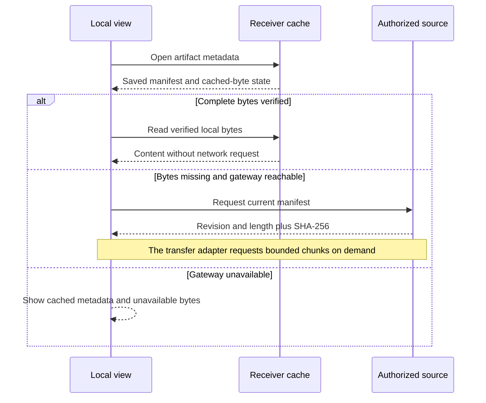

# Artifact manifest and availability contract

**Status:** the manifest, pure validation, SHA-256 identity and small status
example are implemented under [issue #20](https://github.com/nessalabs/sync-engine/issues/20).
The [bounded transfer reference](artifact-transfer.md) implements persistent
staging under [issue #21](https://github.com/nessalabs/sync-engine/issues/21). Nessa file access and
retention remain with [its adapter](https://github.com/nessalabs/nessa-agent/issues/273).

An artifact is an opaque host-selected identity in one exact receiver scope. The
source assigns a monotonic revision and returns either a content identity
(`length`, SHA-256) or a retained deletion marker. The content identity names
complete immutable bytes. A new version uses a new revision and hash. The sync
core does not infer an artifact from transcript text, resolve paths, grant file
permissions or treat a receiver cache as a backup.

## Ownership and ports

| Owner | Contract |
| --- | --- |
| Host/source | Choose artifact IDs, revisions, retention and current grants. `ManifestSource` checks policy before returning one current manifest. `Missing` and `Unavailable` never mean deletion. |
| Pure domain | `validate_manifest` checks exact request/scope, monotonic revision, same-revision identity and the retained deletion fence. `ContentIdentity` uses SHA-256 over complete bytes. |
| Receiver host | `ArtifactCacheIndex` reports local metadata and candidate-byte presence without network I/O. It preserves a deletion fence across access-epoch resets. It verifies the actual bytes before calling them cached. |
| Reference transfer adapter | Read bounded chunks after current authorization, stage them under exact content identity, resume only matching progress, hash complete bytes, then atomically publish the verified cache entry. |

`ArtifactCacheIndex.has_candidate_bytes` is a hint, not proof of content
integrity. The small `availability` helper recomputes SHA-256 over an in-memory
value for the reference example. A large-file adapter should hash incrementally
and expose `CachedVerified` only after a complete length and digest check; it
must not load a large file just to use this helper.

## State and failure order

| Current manifest and local bytes | Result | Required behavior |
| --- | --- | --- |
| Live, no bytes, source reachable | `MetadataOnly` | Show metadata; fetch bytes only on demand. |
| Live, no bytes, source unreachable | `SourceUnavailable` | Show metadata and explain that bytes await the gateway. |
| Live, full bytes match length and SHA-256 | `CachedVerified` | Serve local bytes with no network read. |
| Live, bytes differ in length or digest | `HashMismatch` | Do not publish or display those bytes as verified; retry from a clean staging state. |
| Retained deletion marker | `Deleted` | Hide bytes and fence older live replies, even if a local copy remains. |
| Explicit denial or changed access epoch | No availability success | Host invalidates affected cache and refuses reads until policy and scope are reconciled. |
| Missing or malformed source answer | No inferred deletion | Keep last known metadata with an honest stale state; do not advance a revision. |

A reply must echo its exact `ManifestRequest`. A revision cannot move backward,
change content at the same number, or turn a deletion marker back into a live
artifact within that identity. The current pure validator requires the exact
saved scope; carrying deletion fences across access epochs is a durable cache
adapter responsibility. A replacement source incarnation needs an explicit
host reconciliation decision and must not silently reuse stale verified bytes.

Transfer priority is command/receipt and Stop, then the open transcript, changed
catalogue entries, older history, and requested artifact chunks. Background
artifact prefetch is off by default on metered or weak links. The host scheduler
must give urgent work a chance between bounded chunks. A cache hit needs no
remote content read, but policy refresh and head checks may still use network.

Run `cargo run --locked --example artifact_contract` for the five-state example.
The reference now has a persistent SQLite artifact cache and loopback chunk
transport. It still has no remote pairing, host retention worker or backup
mechanism; those claims require their own implementation evidence.
