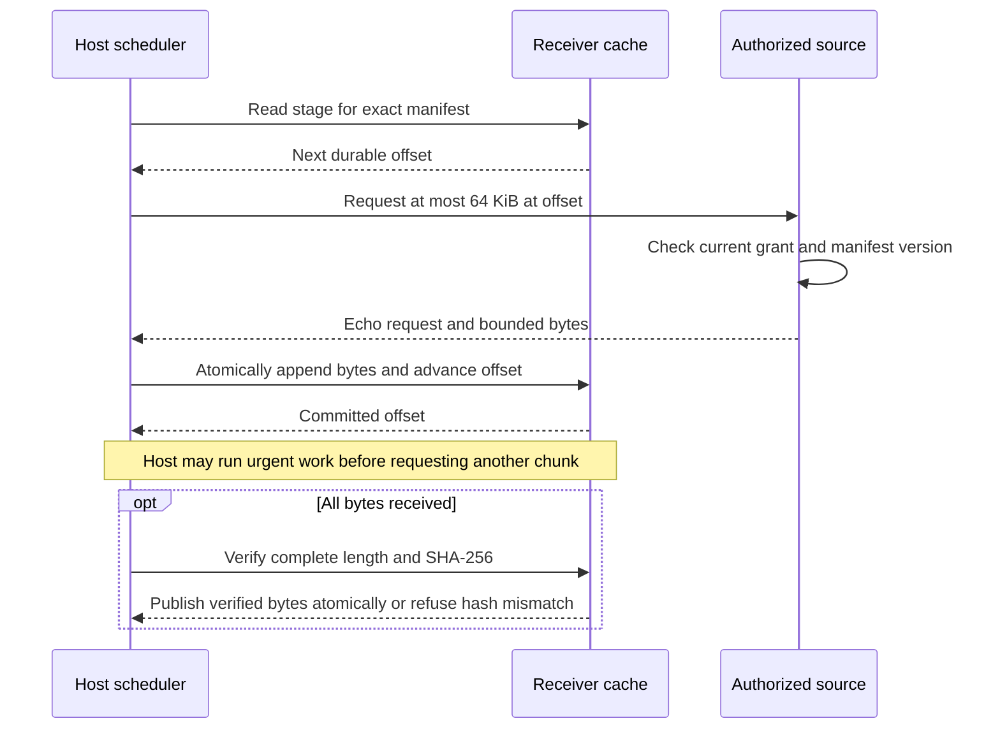

# Bounded artifact transfer

**Status:** bounded reference transfer implemented under [issue #21](https://github.com/nessalabs/sync-engine/issues/21).
The [manifest contract](artifact-contract.md) owns identity, revision, digest,
availability and deletion states. This document owns the additional transfer
ordering. The host still owns file permission, retention and scheduling policy.

## One chunk at a time

The request identifies the exact receiver scope, artifact, revision, length and
SHA-256 from a validated live manifest, plus an offset and bounded maximum
length. The source checks current authorization **and** compares the current
manifest with the requested content identity before reading a chunk. It returns
an exact request echo and bytes from that offset, never from a newer version.
A changed, deleted, narrowed or unavailable source returns a typed refusal;
missing bytes are never interpreted as deletion. A single chunk is at most 64
KiB in the reference adapter. The host can yield to command receipts, Stop,
open-transcript records and catalogue changes between chunks. No background
prefetch occurs by default on metered or weak links.

## Durable state and failure order

| State or event | Source/cache response | Durable consequence |
| --- | --- | --- |
| Valid live manifest, no stage | Begin a stage keyed by exact scope, ID, revision and content identity. | Offset zero; no verified bytes. |
| Valid next chunk | Check exact echo, offset, size and current manifest; append under compare-and-swap. | New bytes and next offset commit together. |
| Same chunk after lost reply | Reload saved offset. An exact repeat is a no-op; differing bytes at the same offset are a conflict. | Never append duplicate bytes. |
| Crash before chunk commit | Stage still has old offset. | Retry that chunk. |
| Crash after commit but before reply | Reload new offset. | Continue from the committed offset. |
| Source changed version or deleted | Reject the old chunk. Read a fresh authorized manifest. | Old stage is not published; a deletion marker fences verified bytes. |
| Access epoch changed or grant denied | Refuse the request before byte read. | Stage is quarantined/erased according to host policy; no old-scope publish. |
| Final hash differs | Refuse publication and discard suspect staging bytes. | Last verified version, if still authorized, remains separate. |
| Final hash matches | Commit a verified marker after all bytes are durable. | Local view may now read bytes without network. |
| Gateway sleeps or link drops | Leave the durable stage untouched. | UI distinguishes cached metadata from unavailable bytes. |

The source need not keep historical byte versions. A requested revision is
valid only while it remains current and authorized. It may therefore force a
restart when an artifact changes mid-transfer. The cache must not publish a
completed old stage merely because the old hash matches after a newer
manifest or deletion has arrived. A deletion fence survives an access-epoch
reset. Verification is over the complete staged byte sequence, not the digest
reported by a candidate cache index.

The reusable application calls are `transfer_one` and `publish_if_current`.
The first commits at most one chunk from saved progress; the second obtains a
fresh authorized manifest and installs a newer version or deletion before it
asks the store to publish. Hosts still own when to call them and how to react
to denied or unavailable scope checks. The reference CLI erases live cache
bytes and fences an explicitly denied old access epoch.

The process lab uses a source process and persisted receiver, interrupts and
resumes a multi-chunk artifact, changes and deletes during transfer, serves an
urgent record read between chunks, rejects wrong bytes and stale grants, and
reports payload, repeated and protocol bytes. It is evidence for the reference
adapter only. It does not make the receiver a backup or prove production
network security, Nessa file authorization or mobile behavior.

Run `python3 scripts/verify-artifact-transfer.py`. The lab uses a source
process, separate SQLite cache, a 1 MiB artifact, one 64 KiB request per host
step, process and connection restarts, a changed version, a deletion marker,
wrong bytes, a narrowed access epoch and an urgent record-head read. It reports
content, duplicate and protocol bytes. The SQLite adapter holds latest source
bytes and receiver chunks in distinct files, verifies staged chunks before
setting its durable `verified` marker, and rechecks the hash on a cached read.
The `SqliteArtifactSource` storage adapter does not itself authorize callers;
the loopback server checks the development credential and exact scope before
each manifest and chunk read. A production adapter needs authenticated policy
and transport at that boundary. This is a cache, not an independently
restorable backup.
