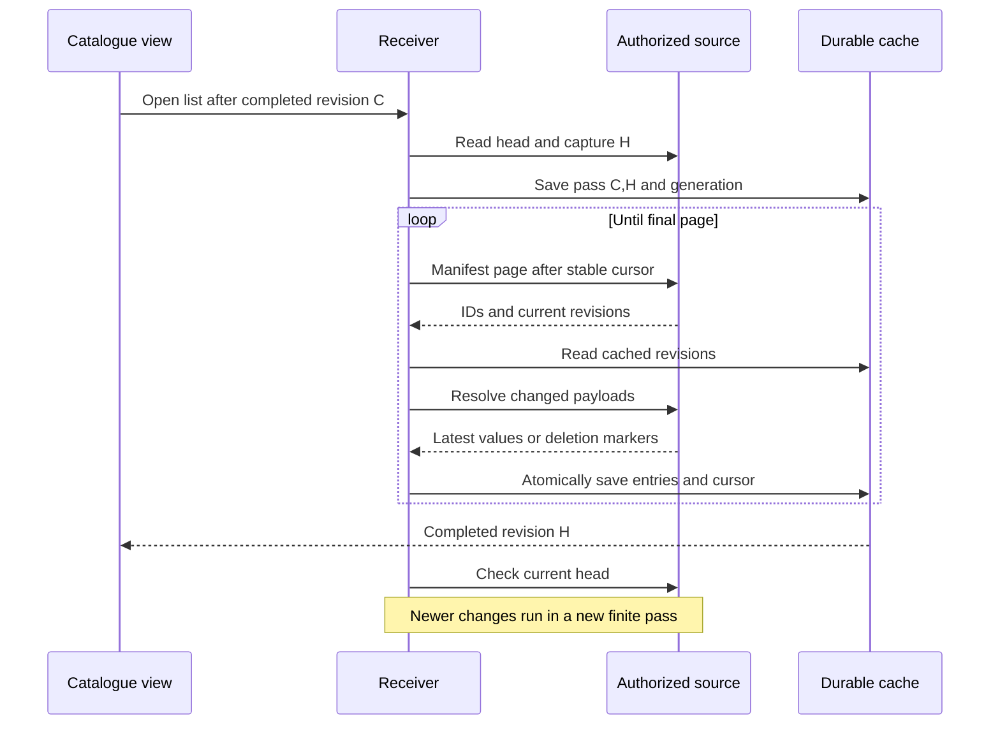

# Slice 6: finite catalogue passes

## Decision

A catalogue stores the latest value for each stable entry identity. It is not a
history stream. The source assigns an immutable creation revision and advances a
single durable revision for every visible change, including deletion. Deletion
retains a marker at the original creation key and permanently fences content for
that identity.

A receiver pass starts after completed revision `C`, captures boundary `H`, and
pages by `(creationRevision, entryId)` through entries created by `H` and
changed after `C`. Page values can be newer than `H`. Edits behind the cursor
and creations above `H` wait for the next pass. The receiver saves the page
cursor only after all selected entry payloads are resolved and the page commits.
The final page alone advances completed revision to `H`. A fresh head check
then discovers any newer work. One source transaction covers each metadata
page. The slice 6 lab uses separate local SQLite files. Slice 7 carries the
same source operations over a bounded loopback adapter, with per-read credential
and scope checks; each source SQLite read finishes before the network write.

The public `replication::catalogue::MAX_CATALOGUE_ENTRIES` ceiling is 256
manifest entries per request. `MAX_CATALOGUE_PAYLOAD_BYTES` is 1 MiB of
combined resolved payload per page. Hosts can use these values to reject
requests before reading their stores; each request may select smaller limits.
The reference loopback transport uses smaller limits to fit its wire frames.

`python3 scripts/verify-slice-7.py` starts a source process and two persisted
receivers for a 620-entry pass. It resumes after a receiver restart, edits and
deletes entries during a pass, injects dropped and truncated replies, and reports
manifest, payload, duplicate and protocol bytes. A local `show` reads only the
receiver database. The reference tokens and loopback socket are not production
pairing, encryption or remote connectivity.

## State and ordering contract

| Event | Required result |
| --- | --- |
| Host checks a manifest request before source I/O | Pure `validate_manifest_request` owns nonzero entry count, core/caller entry ceilings, advancing boundary and nonzero generation; it borrows the request without payload, allocation or effects. |
| Invalid request accompanies a contradictory response | `validate_manifest` consumes the request owner first and preserves typed `InvalidRequest` precedence; response correlation/order remains its responsibility. |
| Request fits the published ceiling but exceeds the caller's smaller ceiling | Request owner refuses `InvalidRequest`; an exact fitting count is accepted. |
| Source head equals completed revision | No payload reads and no pass restart. |
| Mutation while a pass runs | Preserve `C,H,cursor`; finish the pass. A later pass can pick up revisions above `H`. |
| Earlier entry changes after its key was passed | Next pass selects it because its current revision exceeds `H`. |
| Manifest changes before payload read | Resolve the latest authorized value or deletion marker; commit neither entry nor cursor on unavailable or unexplained absence. |
| Payload changes after resolution | A later pass detects the higher revision. A stale response cannot overwrite a newer cached revision. |
| Payload read or cache transaction fails | Keep the previous durable cursor and completed revision; restart retries the page. |
| Interrupted pass | Resume exact `C,H,cursor,generation`; do not capture a new boundary. |
| Final page commits | Advance completed revision to `H` in that same transaction, then check head. |
| Old pass/reset response arrives | Exact scope, incarnation, epoch and generation compare refuses it. |
| Authorized deletion arrives | Save a retained marker and content fence; no later content response restores that identity. |
| Scope/incarnation changes | Explicit reset removes old live cached values, retains deletion markers, and advances generation. Old epoch pages cannot commit into the new scope. |
| Partial pass omits an entry | Infer nothing about that entry. Full reset starts from an erased live cache, so the reference adapter never interprets absence as deletion. |
| Public page plan contradicts its manifest, cursor, final flag or resolved/unchanged coverage | The pure `validate_catalogue_page_plan` owner refuses before a store transaction; the reference SQLite adapter consumes it. |
| Empty final page follows a saved cursor | `CataloguePagePlan::new` retains that cursor and completes the fixed boundary; empty metadata does not rewind continuation. |
| Manifest repeats an identity under a different stable key | `validate_manifest` refuses `InvalidOrder`; key ordering alone does not establish distinct identities. |
| Resolved deletion bit differs at the manifest's same revision, or a deleted manifest resolves live at a newer revision | `validate_resolved` refuses `WrongPayload` before payload/cache effects; revision identifies immutable meaning and a deletion cannot resolve as content. |
| Live manifest resolves at the same live revision, a newer live revision, or a newer deletion revision | `validate_resolved` accepts compatible current evidence; descriptor age does not prevent a newer authorized value. |

`CataloguePagePlan::new` derives correlated plan fields and asks the same pure
validator used by stores. Because the public DTO can subsequently be changed,
a store calls `validate_catalogue_page_plan` before effects. This validator owns
structural correlation and the published page ceilings. It does not read durable
progress, establish that an unchanged entry is actually cached, authorize a
scope, or enforce retained deletion; those decisions belong to the store and
host ports. `catalogue_plan_validation` tests the public combinations, and
`catalogue_replication` exercises refusal without durable changes and an empty
final-page continuation through the real SQLite adapter.

The reference SQLite adapter supplies one current row per ID plus retained
deletion markers. The host owns entry schema, authorization policy, scheduling,
and meaning of absence. The adapter never keeps per-receiver payload history on
the source. The local store keeps only current entry values and pass progress.
When integrating with a product that must retain live values across a full
reset, the host must implement the ownership-aware post-pass absence lookup in
the wider sync contract. This reference adapter chooses an eager privacy wipe
on scope change and has no cached live values to classify after that reset.

The [issue39](https://github.com/nessalabs/sync-engine/issues/39) request-only owner is published for host adapters that validate before metadata
access. It establishes request admissibility, not authorization, physical source
identity, durable pass correlation or cursor/entry ordering. Those relationships
remain with their existing owners. `catalogue_request_validation` exercises the
same owner directly and through response validation, including exact ceilings,
large revision values and refusal precedence. No fabricated page is needed.
