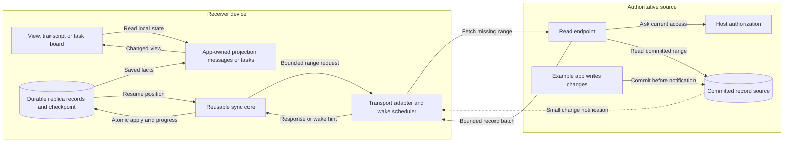
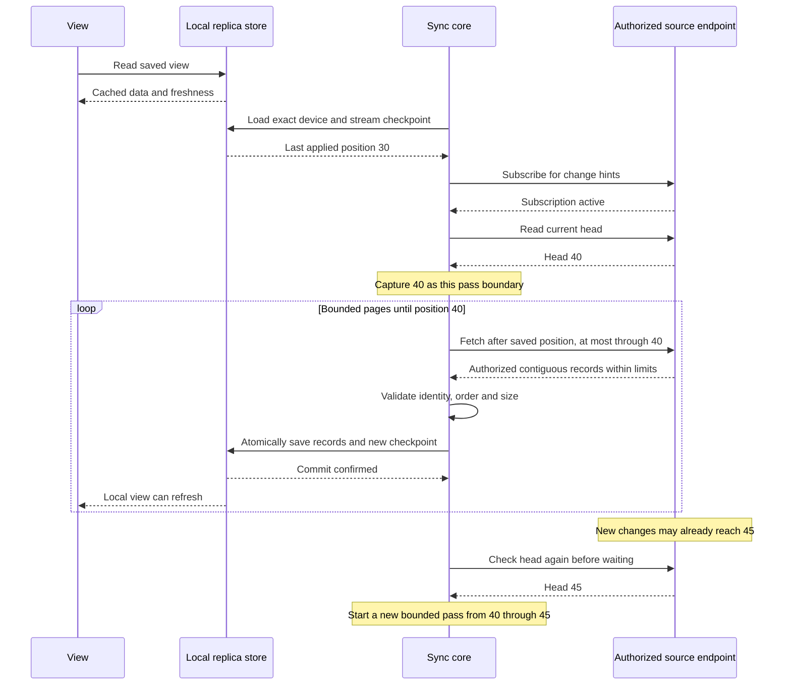
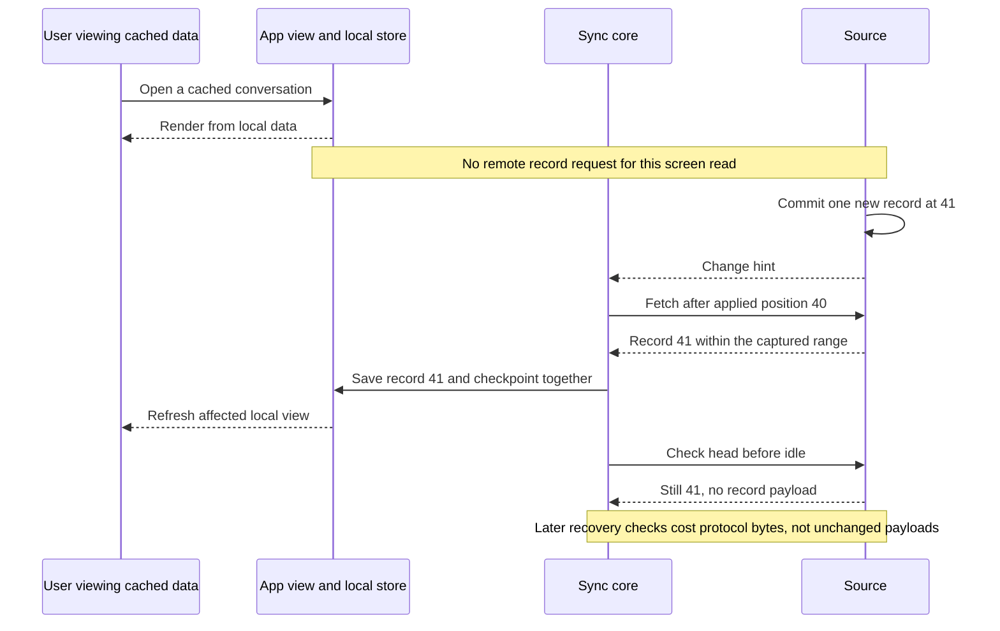
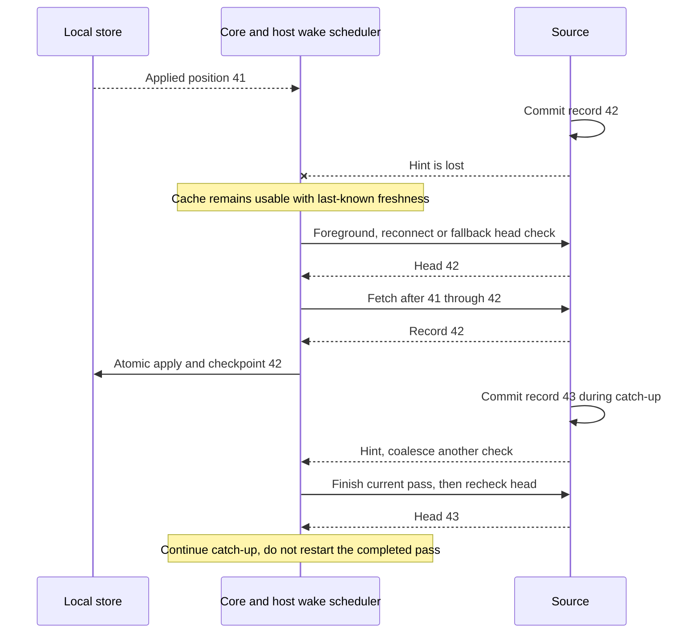
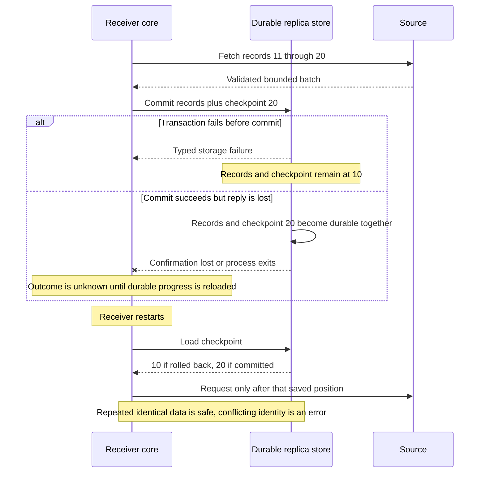
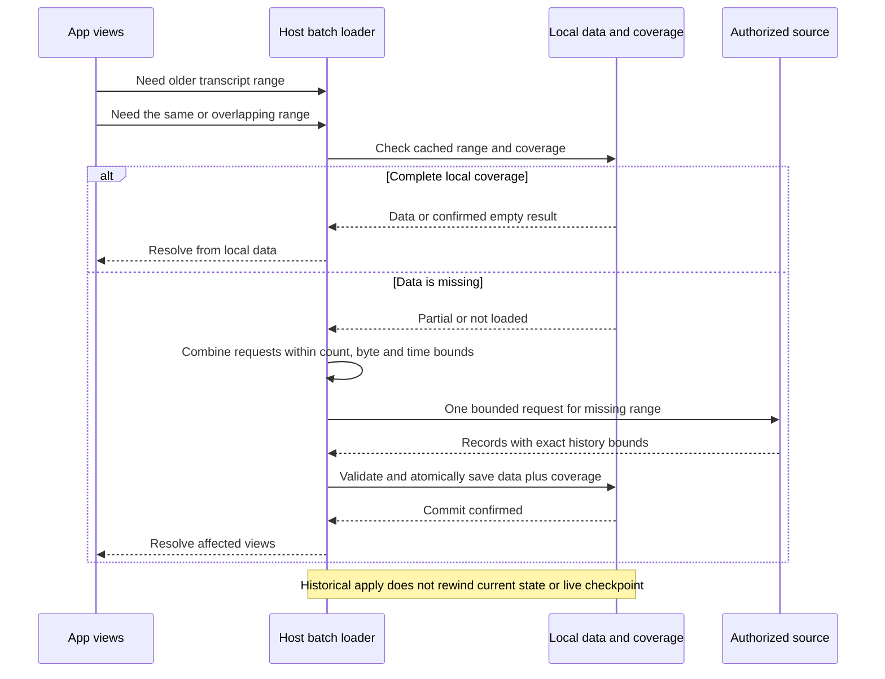
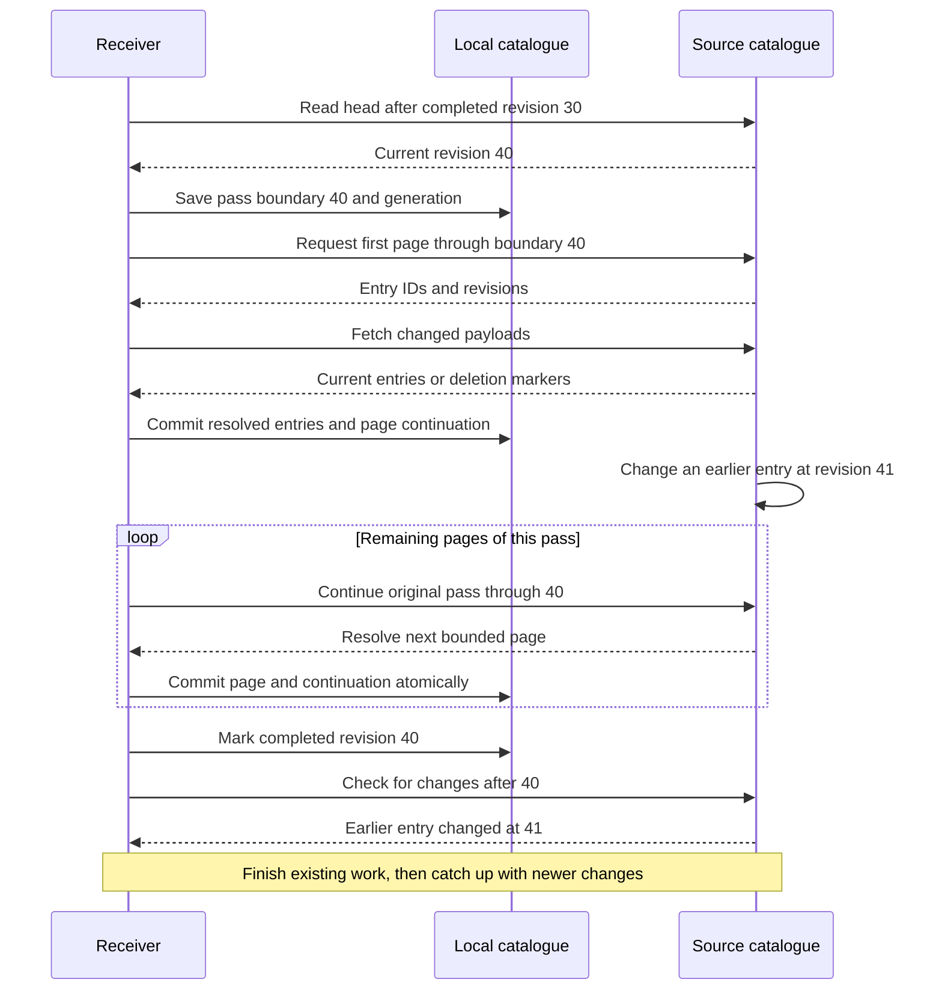

# How the reference sync core works

These diagrams explain the six implemented reference slices. They simplify
details in the code; the [implementation plan](../implementation-plan.md) and
slice-specific design notes identify the runnable evidence. The [product target
contract](sync-engine.md) also describes Nessa integration that this library
does not implement.

## 1. The pieces and who owns them

Like the Linear talk's view/object-store/sync diagram, the view reads local data.
Our application supplies the data model. A transcript app turns saved records into
messages; a task app turns them into tasks. The core transports neither task rules
nor agent execution rules.

Arrows show data and calls, not Rust imports. The source endpoint owns access checks;
the receiver does not grant itself access. The diagram's notification arrow passes
through the authorized delivery adapter. The core's application code uses injected
ports; infrastructure implements them and the pure domain imports neither.

The first apps change their authoritative example source explicitly. A future
client mutation queue belongs to an application command contract, with its own
acceptance, rejection and recovery behavior. It is not implicitly provided by record
replication. Replaying received records only updates a view and never runs an agent
or repeats a task-changing command.

## 2. First load or reconnect: finish one known range

A **checkpoint** is the last position whose data was saved successfully on this
device. A **pass boundary** is the source head captured for one finite download.
For example, a phone at 30 can finish through 40 even if the source advances to 45.

The transport subscription is introduced in slice 3. Slice 1 drives the same pass
logic through injected ports. Each page releases storage reads before waiting on
the connection. One slow receiver does not hold a source-wide catch-up lock.
Every receiver stores its own progress, independently of other devices.

## 3. A small change and an unchanged screen

Opening a cached screen does not fetch its records remotely. Source changes wake
catch-up. A notification contains a hint, not proof that a position was saved locally.

For the example receiver service, browser-to-localhost requests are local reads.
Measure them separately from traffic to the authoritative source. A cached view
can be stale and usable at the same time; show that state rather than a false
claim of current data. Do not promise zero network bytes while a connection is alive.

## 4. Lost hints and a changing head

The connection is a fast signal. The durable range is the recovery mechanism.
The host schedules bounded fallback checks and reconnection; the core does not
silently start a timer or a second reconnect loop.

A hint arriving during the final head check must remain pending or be covered by
an immediately following check. The owner serializes the idle transition and
pending wake state; it must not clear a newly arrived hint while becoming idle.
Fallback checks recover loss, but are not a reason to omit this ordering test.

## 5. Crash or lost commit reply

The checkpoint means applied and saved. It must never mean merely received.

The replica adapter must compare expected progress and write inside one transaction.
Two independent database handles are part of its conformance tests. Domain validation
alone cannot prove an adapter's atomicity. A successful compile is not recovery evidence.

## 6. Partial loading without pretending missing means empty

Slice 5 adds history storage and reset contracts to the record core.
A view asks for data; the loader checks local coverage, combines overlapping requests,
and fetches only missing ranges. An explicit coverage marker distinguishes a complete
empty result from data not yet loaded.

Prefetching is optional and must respect data limits. Do not copy the talk's concrete
MobX object graph or schema-reset strategy into the core. The reusable requirements
are local reads, known coverage, bounded hydration and coherent state after restart.

## 7. Catalogue pages keep their finish line

Slice 6 adds a separate catalogue. It is the current list of entities, not every historical
version of their previews. It therefore has a separate progress contract.

Current entry values may be newer than boundary 40; the completed boundary is a
coverage guarantee, not a snapshot of every value at one instant. The detailed
catalogue design governs stable ordering, payload races, auth epochs and deletion
fences. The reference reset wipes old live values before the new pass; Nessa's
ownership-aware absence classification remains a product target. Catalogue
pages in the current example use local SQLite ports, not the loopback wire.
A partial page never proves that an unseen entry was deleted.

## First-slice transition and verification map

These rows summarize record-delivery evidence from slices 1–3. History and
catalogue ordering have their own [tail-history](tail-history.md) and
[catalogue-pass](catalogue-pass.md) tables. The broader Nessa rules remain in
the [product target design](sync-engine.md).

| Trigger | Core/application response | Persistent result or assertion |
| --- | --- | --- |
| New receiver | Check source head, capture a bounded target | Separate checkpoint starts at zero |
| Valid page | Validate correlation, then commit one plan | Records and checkpoint appear together |
| Gap or out-of-order record | Return typed refusal before apply | Previous data/progress unchanged |
| Wrong origin, incarnation, schema, receiver or epoch | Reject the response | No cross-scope apply |
| Page/count/byte limit exceeded | Reject, including wire bound in transport adapter | No unbounded decode or partial apply |
| Next record cannot fit | Explicit oversized-record outcome | Do not skip that position |
| Current access denied or unverifiable | Refuse the corresponding source read | No unauthorized batch is produced |
| Source head is older than applied checkpoint | Source/history mismatch | Do not rewind or silently reset |
| New writes or duplicate hints during a pass | Finish its captured target, then check again | Finite pass completes under churn |
| Hint races final check/idle | Retain pending wake or make another check | New head is discovered without relying on chance |
| Store failure or uncertain commit | Report typed failure, reload durable progress on retry | No invented acknowledgement |
| Competing replica writer | Compare-and-swap inside transaction | Exact repeat or conflict, no mixed records/cursor |
| Repeated record ID with changed content | Refuse conflict | Original committed meaning remains intact |
| Drop follower or restart process | Lose only non-durable scheduling state | Next follower resumes from saved progress |
| Source has no new records | Return caught-up result | Zero new record payload bytes |

The host owns payload schema validation and should refuse an unknown required schema
before committing that data. The core compares declared stream/schema identity; it
cannot validate opaque product meaning. Host authentication and current authorization
must precede source access. Scope IDs alone are not security credentials.
