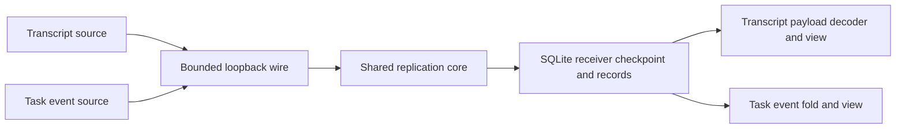

# Slice 4: two local apps, one sync core

The transcript and task board share the exact `begin_pass` / `finish_pass`,
`LoopbackClient`, and `SqliteReplicaStore` contracts. Their source identities,
record payloads and local views belong to the example host. The core never
parses a message or knows what a task is.



```mermaid
sequenceDiagram
    participant S as Example source
    participant P as Phone sync process
    participant D as Phone SQLite
    participant V as Local browser view
    S->>S: Commit one message or task event
    P->>S: Authorize and fetch after checkpoint
    S-->>P: One bounded record page
    P->>D: Validate and atomically apply records and checkpoint
    P->>P: Save last check and byte counters in host status file
    V->>D: Read cached records
    D-->>V: Saved events and applied position
    V->>V: Decode transcript or fold tasks
    Note over S,V: Source can stop; the view still reads SQLite
    V->>D: Navigate or refresh locally
    D-->>V: Cached view without source request
    Note over P,S: On reconnect, fetch only after saved checkpoint
```

The source offers two separate streams in the lab, each with its own SQLite
source file and schema ID. A transcript event carries one UTF-8 message. Task
events carry create, title, completion or deletion operations. The task view
folds events in committed order; a deletion removes that task from the current
view. Receiver pages remain opaque to the core.

The browser service binds only `127.0.0.1` and reads its receiver file on every
request. Its two-second refresh is local traffic and never calls the source.
The displayed position comes from the receiver checkpoint, while the explicit
host status file records the last attempted check, last applied change time,
and per-sync wire counters. An unchanged or failed check does not move the
last applied time.
If the status file is absent but committed records exist, the view shows cached
records with a **partial** label. If neither checkpoint nor successful empty
check exists, it says **Not loaded yet**. A successful zero-head check says
**Complete and empty**. A failed source check retains cached content and marks
the last check unavailable.

| Case | Assertion in `verify-slice-4.py` |
| --- | --- |
| Unsynced versus confirmed empty | Different view states for both apps |
| Browser navigation while source is online | Source head and page counters do not change |
| Source stopped | Cached views still render; failed check marks source unavailable |
| Missing auxiliary status after saved records | View remains partial and shows cached content |
| One source update | Each receiver fetches only the new event payload |
| Unchanged source head | Zero record payload bytes |
| Task deletion | Deleted task disappears after folding a committed delete event |
| Receiver view restart with source stopped | Cached content and checkpoint remain visible |

This example deliberately uses explicit source mutations and read-only receiver
views. It does not accept commands offline, run agents, provide remote pairing,
or solve large-history hydration. Those have separate owners and milestones.
