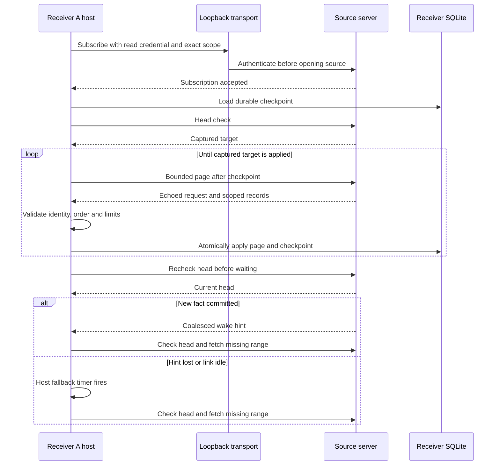
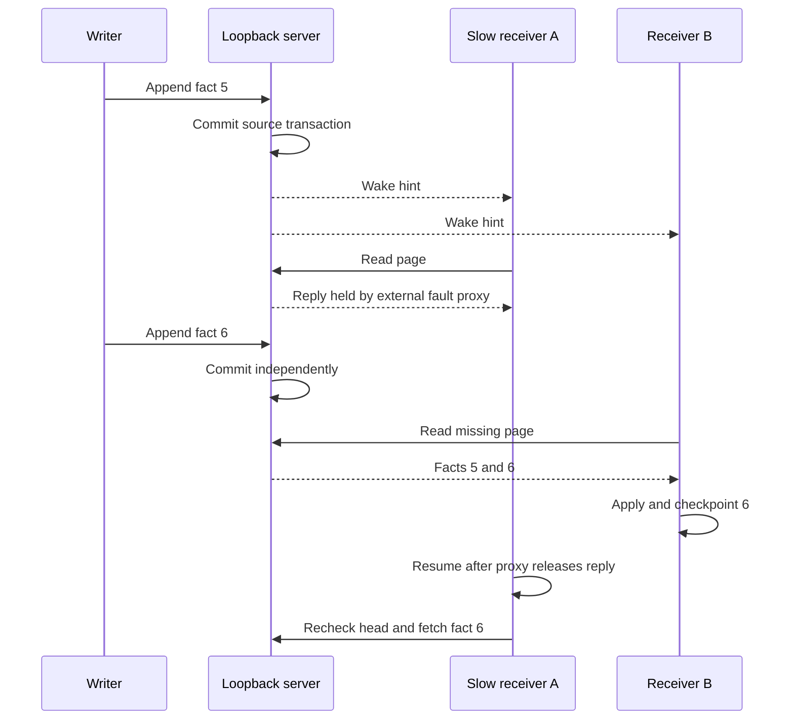

# Slice 3: loopback transport and recovery

This is a development example of the [sync contract](sync-engine.md). The
reusable domain and application code still knows only authorized scopes,
bounded record pages and atomic receiver checkpoints. The optional `transport`
adapter frames requests and responses. The example host owns scheduling,
credentials and the receiver's SQLite file.

The subscription is established before catch-up. A fact committed during the
pass remains beyond its captured target; the post-pass head check observes it.
A fact committed after that check has a queued hint because the subscription
already exists. If the hint is lost or the connection breaks, the host's next
fallback or reconnect starts from the last committed checkpoint. A hint never
advances progress. A disconnected source cannot provide fresh data; cached
reads continue locally.

## Wire and trust boundaries

- Frames are a four-byte big-endian length followed by at most 1 MiB of body.
  The length is rejected before allocating the body. Decoded page requests are
  further capped at 64 records and 512 KiB payload, and core validation checks
  the host's smaller limits. The response echoes its request and each record's
  scope; the client does not invent those fields during decode.
- Every source read gets a fresh server authorization check against the read
  token, exact source identity, current epoch and receiver allowlist. The write
  token is separate. Both are simple local lab credentials. The server binds
  `127.0.0.1` and the client refuses other IPv4 addresses. Production pairing,
  key rotation, TLS and remote transport remain separate work.
- Each request uses a fresh TCP connection and independent SQLite handle. A
  source page transaction completes before its bytes are written to a receiver
  socket. A failed or truncated reply is retried from durable progress.
- The host chooses its fallback interval. It owns reconnect and idle checks;
  no core timer starts implicitly. A 30-second subscription keepalive releases
  dead server threads. Each subscription sends at most one wake, then closes;
  the host subscribes again before its next catch-up. The example does not
  claim a mobile background schedule.
- Wire counters are process-local. `protocol_bytes` excludes decoded record
  payload, while `duplicate_bytes` tracks repeat positions seen by that client
  process. It cannot infer traffic from a previous process. Applied lag is
  measured after the post-pass head recheck, where a completed pass reports zero.

## Fault evidence

| Ordering or failure | Real boundary assertion in `verify-slice-3.py` |
| --- | --- |
| Offline receiver, source advances | Reconnect fetches only fact 3 from checkpoint 2 |
| All wake hints lost | External proxy discards hints; host fallback reaches fact 3 |
| Reply truncated after source read | Checkpoint stays at 3; fresh connection reaches 4 |
| Page identity changed in flight | Core rejects echoed scope; checkpoint stays at 4 |
| Slow receiver socket | Proxy holds A's page while source appends and B reaches 6 |
| Source writes during subscription setup | Proxy holds subscribe acknowledgement, source commits fact 7, receiver catches it on first head check |
| Wrong credential or receiver | Server refuses before its source head count changes |
| Over-limit wire length | Server rejects header and stays available |
| Low bandwidth, RTT and outage | Optional profile transfers 30 payload bytes and resumes after outage |

The optional profile is a small correctness experiment. It does not model radio
packet loss, mobile OS background policy, battery cost, relay availability or
large Nessa transcripts. Those need later experiments before service targets.
