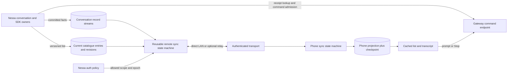

# Sync engine contract for local-first agent applications

**Status:** proposed Nessa product target under [the sync ADR](../adr/1-reusable-local-first-sync-engine.md).
The standalone core completed [seven reference slices](../implementation-plan.md),
but this document also specifies Nessa integration that has not shipped. Existing
conversation execution, authentication, storage and deletion owners retain their
authority until their migrations are implemented and verified.

| Area | Reference code today | Product work still needed |
| --- | --- | --- |
| Immutable transcript records | Bounded `RecordSource`/`ReplicaStore` ports, SQLite and loopback adapters, restart and fault labs | Nessa canonical record source, shared projection fold and authorization adapter |
| Recent and older transcript | Tail/older ports, durable boundaries and loopback history lab | Nessa snapshot composition, phone projection and lifecycle integration |
| Conversation catalogue | Current-entry revisions and finite passes over local SQLite, plus bounded development loopback transport | Nessa ownership query, revisions/tombstones, production transport and ownership-aware absence handling |
| Device and command path | No production implementation | Pairing, authenticated remote link/relay, phone cache, durable command receipts and Stop |
| Artifacts and recovery | No implementation | File manifests/content transfer and independently restorable backup/restore |

**Delivery scope:** this document includes the later Nessa integration target. The independent core and example apps are delivered first through the [vertical-slice plan](../implementation-plan.md). Nessa storage, pairing and command integration are not prerequisites for the standalone core.

## Product boundary and topology

The first supported topology is one home gateway and one or more linked phones. Each phone can read a locally cached conversation list, saved transcript, and current agent milestones; a foreground phone can send a prompt or Stop to the owning gateway. The SDK coordinator hosted behind the home gateway is the authority for accepted commands and transcript facts for each conversation; the gateway routes and authorizes. The [portable runtime design](https://github.com/nessalabs/nessa-agent/issues/252) keeps that owner distinct from execution workers. The phone owns only its cache, drafts, durable command outbox, and applied checkpoints. The first phone host embeds Nessa's shared Rust projection fold through platform bindings, outside reusable `nessa-sync`; the mobile UI framework may vary around that boundary. Changed files, artifact bytes, simultaneous writers for one conversation, and automatic execution of an offline phone command are later work.

The diagram's arrows represent data or requests, not package dependencies. The reusable crate knows only its own domain and application ports. Nessa owns pairing, policy, command routing, provider execution, and conversation projection semantics. In the first delivery the optional relay forwards authenticated envelopes to an **online** gateway; it stores no catch-up feed and makes no authorization decision. Every record batch is authorized by the gateway at send time. A later offline-serving relay needs its own decision for bounded grants, revocation latency, record authenticity, and metadata exposure. A phone and gateway on the same reachable local network can operate without a hosted account or relay. A phone away from home needs a reachable path; the UI reports last-synced data when none exists.

## Crate ownership and dependency direction

Proposed package: `crates/nessa-sync`, with feature-first modules and domain/application/infrastructure layers following [the repository's DDD rules](https://github.com/nessalabs/nessa-agent/blob/main/CODING_STANDARDS.md#domain-driven-design-boundaries). The name is provisional; its public contract is intended for other agent applications.

| Layer | Owns | Must not own |
| --- | --- | --- |
| Domain | Validated `ReplicaId`, `StreamId`, `StreamIncarnation`, `RecordId`, dense `Position`, `Checkpoint`, `CatalogueRevision`, `CataloguePass`, `SnapshotWatermark`; state transitions and invariants. | Nessa IDs, JSON, sockets, clocks, filesystem, provider or UI types. |
| Application | Remote `catch_up`, `follow`, `apply`, `reset_from_snapshot`, and older-page backfill use cases; bounded catalogue passes, ordered batches and retry outcomes; narrow ports and boundary DTOs. | Conversation permission rules, agent execution, backup destination, concrete serialization, local replay-then-live. |
| Infrastructure | Optional adapters for `event-stream`, local SQLite cache, direct/relay network, codec, and clock, wired by the consuming application. | A second implementation of product policy or merge rules. |
| Nessa integration | Translate stable conversation facts and auth decisions; own device grants, read-only receipt lookup, command forwarding, one shared Rust projection fold over ADR 0009's canonical records, and audit. | Reimplement sync ordering or checkpoint algorithm. |

Application-owned ports have these semantic contracts; exact Rust signatures are fixed after the adapter spike:

| Port | Required behavior |
| --- | --- |
| `RecordSource` | For one authorized dense stream and applied position, return a bounded contiguous range of committed records, source head/watermark, or a typed pruned-gap/incarnation error. ADR 0009's adapter owns the local append/cursor/replay-then-live algorithm. A live notification only wakes another read and coalesces per stream. |
| `ScopeAuthorizer` | Before each batch, return the current decision and access epoch for that device and stream, or a typed denied/unverifiable result. Either failure stops delivery; only authenticated denial or narrowing triggers cache invalidation. Nessa implements the decision; the crate enforces that a batch cannot be produced without it. |
| `ProjectionStore` | Atomically validate/apply a record and save the resulting checkpoint, or change neither. Reject a different record under an existing `RecordId`. The application supplies its projection fold, deletion fence, and historical-content installer. Backfill never runs the current-state fold. |
| `SnapshotStore` | Return a self-consistent transcript snapshot with exact upper/lower stream watermarks. One per-stream reset generation owns installation. Atomically compare identity, scope epoch, reset generation, and current applied watermark before replacing projection/checkpoint/fences; reject a delayed snapshot older than applied state. Catalogue progress uses its own store contract below. |
| `CatalogueSource` | Read current authorized catalogue entries and retained deletion markers in bounded passes using the revision and paging contract below. Every page uses a short independent metadata transaction, closes before network I/O, and checks current authorization/epoch. Ordinary metadata changes do not restart a pass. No per-device summary log or transaction across phone round trips is stored. |
| `CatalogueStore` | Atomically apply a resolved page with its continuation, checking origin/incarnation, scope epoch, reset/pass generation, entry revisions and deletion fences. Advance the completed revision only when every page and required payload in that pass is durable. On failure retain the previous committed page position. An incremental page cannot establish absence. |
| `Transport` | Exchange bounded framed requests/responses and cancellation; expose connectivity/timeout as typed outcomes. A transport acknowledgement does not imply projection apply. |
| `Clock` | Supply expiry and retry timing to application use cases; tests substitute a deterministic clock. |

The `event-stream` library may implement `RecordSource` and local append through the adapter owned by [ADR 0009](https://github.com/nessalabs/nessa-agent/blob/main/docs/adr/todo/0009-reusable-event-stream-crate.md). It already owns local replay followed by live subscription; `nessa-sync` starts at an authenticated remote request, validates remote order, and commits the receiver projection/checkpoint. Its replication feature is not the Nessa wire protocol. The crate can run with in-memory ports in domain/application tests and with another store or transport in another agent application.

## Record and checkpoint contract

A saved record envelope contains `originReplicaId`, `streamId`, `streamIncarnation`, positive contiguous `position` within that incarnation, immutable `recordId`, `schemaId`, and payload bytes. The source commits the envelope before advertising it. Gateway-to-device authenticated encryption binds each batch to stream identity, epoch, requested range and a phone request nonce; the phone verifies the owning gateway key end to end, so a forwarding relay cannot substitute or manufacture records. Command replies bind the same device request identity and `requestId`. Stable `recordId` identifies one fact; ADR 0008's `requestId` identifies one requested product action. They are different identities. The Nessa adapter validates the typed payload before applying it; unknown required schema yields a typed incompatibility state rather than a skipped record. Transcript records carry the shared rich-content schema as bounded, ordered durable segments (`messageId`, segment order, final marker). A turn's terminal outcome closes any open segments if no final message marker arrived. The source coalesces tiny token bursts under a measured byte/time bound and splits large output; ephemeral token hints never substitute for saved segments. The phone stores that one content representation.

A transcript checkpoint is `(receivingReplicaId, originReplicaId, streamId, streamIncarnation, accessEpoch, lastAppliedPosition)`. It is local to the receiving projection. Receiving or acknowledging bytes does not advance it. Conversation streams are all-or-nothing authorized and contiguous; a gap means loss, pruning, or mismatched snapshot, never filtering. Each receiver stores a catalogue checkpoint `(receivingReplicaId, originReplicaId, catalogueIncarnation, accessEpoch, completedRevision, resetGeneration)` and, while catching up, its durable pass `(C, H, pageCursor, passGeneration)`. Entry revisions and the completed pass boundary are distinct: a newer entry does not advance the completed boundary. No old catalogue response can be applied under a narrowed grant. The auth owner changes the epoch only for affected device scopes; unaffected conversation checkpoints remain. Authenticated revocation or narrowing stops batches and invalidates/wipes affected projection on next contact; inability to check access stops delivery but retains the last cached view. Offline copies cannot be clawed back.

The first delivery uses one origin gateway, its current authorized metadata index, and one record stream per conversation. Later gateways add origins without inventing a global wall-clock order. The phone stores a checkpoint per transcript stream and catalogue progress per origin and access scope. User scroll position and local drafts are surface state. An open transcript can bootstrap from a bounded tail snapshot with both lower and upper positions. That snapshot contains the current aggregate/turn state at its upper watermark and complete message boundaries in the tail; gateway and phone use the same Nessa Rust fold **over ADR 0009 record schemas** to build and advance it. Today's `crates/nessa-server/src/conversation/application/projection.rs` consumes live SDK events and cannot simply be extracted. The ADR 0009 migration must move the gateway's replacement view onto the same record-based fold used by the snapshot builder and phone, verify old/new view equivalence, then retire the event-driven fold in the same contract change. View clipping remains presentation policy, not transcript history limits. The lower missing-history bound is durable projection state. Older pages use bounded forward range reads below that bound and install only missing immutable historical content; they cannot run the live lifecycle fold, alter current status, or advance the forward checkpoint. Overlap is checked by record identity/content, and each page transaction lowers the missing-history bound only when contiguous. A transcript snapshot carries the same origin, stream incarnation, access epoch, and exact bounds as its subsequent deltas. It cannot be combined with deltas from a different identity or scope.

## First-slice Nessa records and commands

| Owner | Durable fact or action | Source of truth and projection |
| --- | --- | --- |
| Gateway conversation application | Created, archived, deleted, owner identity, list summary/current status. | Existing metadata owner remains authoritative. A metadata schema migration adds a durable revision counter and creation/change revisions for current catalogue entries and retained deletion markers. Catalogue-visible mutations advance these in the same transaction. [ADR 182's proposed sync extension](https://github.com/nessalabs/nessa-agent/blob/main/docs/adr/todo/182-conversation-deletion.md) also writes the deletion inventory outbox at the fence. No historical summary payload is introduced. |
| SDK conversation/agent application | Accepted prompt, saved human/agent transcript message, visible action milestone, terminal outcome, stable receipt. | Target canonical semantic record source under ADR 0009; SDK JSONL history needs an explicit import/retirement plan. The panel/phone view is a projection. |
| Gateway command application | Phone prompt or Stop request. | Authorize against current policy, route to the conversation's execution owner, and ask its coordinator for admission/receipt. A reply and a copied record never dispatch work independently. |
| Phone application | Draft, displayed transcript, cached conversation list, durable intent outbox, last-applied checkpoint. | Local cache and retry state only; no authority over agent state. |

An open session means the owner reports a current agent state or an unfinished saved attempt. A provider process handle is not synced. On gateway restart, the SDK resolves uncertain work according to its recovery contract before advertising a current state. The first slice does not transfer file change events or content; a later artifact design must define manifests, content availability, permissions, and backup.

## Protocol flow

1. **Pair:** the gateway creates one expiring, one-use invitation. Its QR carries a rendezvous locator, gateway key fingerprint, and a high-entropy secret. The phone creates its own device key, proves the invitation, and requests scoped grants. The gateway displays device identity and scope for approval, then the existing auth application issues a separately revocable device credential bound to the owner's principal. First-slice grants name **one exact gateway resource** with proposed `sync.readOwnedConversations` for catalogue/stream reads. The prompt/Stop grant remains an open decision in the sync ADR: existing `conversation.write` also permits broader administration, while a new narrow action requires coordinated auth and dispatch changes. Pairing cannot claim a prompt/Stop-only scope until that choice is resolved. The existing `Conversation::allows` domain check and listing owner predicate enforce that each requested conversation belongs to the credential's principal. Cedar checks the gateway-resource grants and does not duplicate the ownership rule. This covers newly created conversations without a per-conversation grant transaction or wildcard. Subset grants need a later decision. The device credential ID identifies the initiator in audit; the accepted prompt's `createdByPrincipalId` remains the owner principal. Other gateways may later be independent principals with explicit grants, but they are not phone credentials. A manually typed short code uses an established PAKE plus attempt bounds; a code is not a lasting credential. Pairing extends ADR 0011's deferred cross-device trust scope, subject to a focused security design before implementation. This follows the mechanisms demonstrated by [Signal linked devices](https://signal.org/blog/a-synchronized-start-for-linked-devices/) and [Magic Wormhole](https://github.com/magic-wormhole/magic-wormhole/blob/master/docs/api.rst), without adopting their account models.
2. **Bootstrap:** authenticate and authorize the owner-and-gateway scope, then start a catalogue pass from completed revision `C=0` for a fresh cache, or resume matching persisted progress. Include archived and unsummarized owned entries; presentation filters do not decide membership. Apply pages progressively according to the catalogue contract below. A scope/incarnation reset creates a new reset generation and a full authorized pass, with absence reconciliation only after it completes. Fetch the selected open conversation's bounded transcript tail with explicit lower and upper watermarks, then older pages on demand. A catalogue entry does not imply its transcript is locally available.
3. **Catch up and follow:** finish each bounded pass before starting another for that scope. Transcript reads use dense committed positions; catalogue reads use current entries and completed revision boundaries. Notifications coalesce to one pending check per scope while a pass is active, and never advance saved progress. On completion check the current head and continue if newer changes exist. Follow and fallback behavior is defined below. ADR 0009 owns local replay/live; this contract owns remote resumable delivery, informed by [Linear's sync engine](https://linear.app/now/scaling-the-linear-sync-engine) and [CouchDB's checkpointed changes feed](https://docs.couchdb.org/en/stable/replication/protocol.html).
4. **Remote command:** before phone support, migrate today's wire `conversation.send(requestId, executionId)` and SDK enqueue contract to ADR 0008's one mutation identity: the caller supplies `requestId`, and the SDK durably maps it to the accepted `turnId` and immutable request bytes for deduplication. The phone atomically saves canonical bytes, owner principal, operation, conversation target, origin incarnation, `requestId`, and initiating credential for audit in its outbox before first send. A Stop also carries the captured `turnId`; transcript head is not a send precondition. Stop requires ADR 0008's unimplemented turn-interrupt operation; today's `conversation.close` ends the attachment and is not its substitute. Stop affects only the named turn; independently accepted queued prompts keep their own `requestId` and need a separate withdrawal action. The gateway checks current authority and asks the SDK owner in queue submission mode. A saved acceptance receipt or typed refusal returns. The same foreground attempt may retry identical bytes/ID within a finite budget after a lost frame. After backgrounding or restart, a new read-only `conversation.requestReceipt` operation keyed by **owner principal, operation, conversation target, origin incarnation and `requestId`** returns a saved receipt, `notFound`, `unresolved`, `deletedTarget`, or `unavailable` without admitting work. It requires current owner authorization and a new SDK read-only receipt port; the original credential remains audit evidence, not the lookup key, so a re-paired device can inspect its owner's intent. ADR 0008's command retry may admit and is not used for lookup. `unavailable` never authorizes retry; `deletedTarget` is returned only when no receipt exists and the owner is deleted. If `notFound`, explicit foreground retry of the same intent may admit. A different request under that full identity is refused. The SDK's persisted `unresolved` outcome requires explicit owner/operator recovery; a replayed transcript record never causes execution.
5. **Reconnect/reset:** after transport loss, the phone keeps its last applied local view and requests after its checkpoint. A different source incarnation, access epoch, unsupported schema, or pruned gap requires an explicit compatible snapshot/reset path. It must not silently jump to the current head.

## Catalogue passes: finish the current work, then check again

A catalogue is the small amount of information needed for the conversation list: identity, title/preview, archive state and current status. It includes all conversations owned by the authorized principal, even if archived or missing a summary. The metadata query must pass an agreement test against `Conversation::allows`; the current presentation-list query is not sufficient evidence for this new reader.

The metadata owner keeps one current catalogue entry per conversation identity with immutable `creationRevision` and mutable `lastChangeRevision`. Every visible field change, including a summary write, advances the durable revision counter and that entry's change revision atomically with the owning metadata mutation. Deletion replaces the visible entry with its retained owner-visible marker, preserving its identity and creation order, advancing its change revision, and removing summary content. This is revision metadata over existing facts, not another summary history. Migration assigns revisions to existing identities and tombstones before enabling sync; a replaced revision history gets a new catalogue incarnation.

A receiver begins at completed revision `C`. The source captures current revision `H` and returns bounded keyset pages ordered by `(creationRevision, identity)`, selecting entries with `creationRevision <= H` and `lastChangeRevision > C` after the page cursor. Each page returns current authorized values, which may be newer than `H`; do not require `lastChangeRevision <= H`. Keeping the creation order stable lets a pass finish under continuous edits. Changes behind the cursor receive a revision greater than `H` and remain eligible in the next pass; entries created after `H` also wait for that next pass. A catalogue pass is not an atomic picture of all entries at one moment, and it need not transmit intermediate preview versions. Transcript history remains a separate ordered record stream.

Compact ID/revision manifests permit conditional payload reads. A payload read returns the latest authorized entry or deletion marker, with its revision and original identity, rather than demanding an obsolete manifest version. Do not advance a page cursor until each required payload is applied or verified already present at that revision or newer. An unavailable or unexplained missing payload leaves the page incomplete; it is not a deletion. Each page's effects and cursor commit together. Entry revisions only increase within the matching catalogue incarnation, and a permanent deletion fence rejects stale content regardless of its arrival order. Responses bind the receiver request, `C`, `H`, scope epoch, catalogue incarnation and pass/reset generation.

When the final page and its payloads are durable, set `completedRevision=H`, even if some entries are newer. A matching source head and epoch can return `notModified` without summary payload. Check the head after completion and start another pass if needed. Disconnects resume the saved `(C,H,cursor)` under the same incarnation/epoch; ordinary metadata churn does not cause a restart. Lost cache state, changed incarnation or changed scope requires an explicit full pass/reset. No source database transaction spans network I/O.

An incremental pass never removes an entry merely because it was absent from the response. Explicit authorized deletion markers install permanent fences. During a full reset, retain a seen-ID set for the pass; after completion, classify only previously cached IDs absent from that set in bounded current-authorized reads. Revalidate each answer's epoch/generation and compare its entry revision before applying it. A live owned result refreshes the entry; an owner-visible deletion installs a permanent fence; an authenticated unexplained absence gives an epoch-scoped fence. Check ownership before revealing deletion: foreign live, foreign deleted and unknown IDs share the public absence result, while unreadable ownership/tombstone state returns unavailable. Apply the same owner-before-deletion rule to receipt lookup. A partial pass, archive state or missing summary cannot establish absence.

## Live delivery and recovery from missed notifications

The default follow mechanism is a server notification that prompts the client to fetch committed changes after its saved progress. Notifications are hints, can be coalesced or lost, and are not acknowledgements of durable apply. Establish the authorized subscription before the initial catch-up, buffer a single pending hint while it runs, and check the head before going idle. Only one pass per scope is active. If the head advanced, finish the current pass and then start the next one; do not restart it or launch a pass per notification.

The client also checks on app open, foreground resume and reconnection. While active, occasional small head checks recover missed notifications even when the connection still appears healthy. Failed checks back off with jitter; metered and background policy controls their frequency. A transport heartbeat only tests connection health. It is not proof that the cache is current. Exact polling and keepalive intervals are parameters for the weak-link spike, not fixed product promises. Background execution remains subject to the mobile OS.

For a frequently updating open transcript, the transport spike compares notification-triggered fetch with direct streaming of bounded committed batches; fetching after every small hint adds a network round trip. A direct stream uses the same record validator, atomic apply/checkpoint, current authorization and finite in-flight byte limits. It resumes after the last applied position on reconnect. Long polling is another adapter candidate: a request waits for changes or timeout, returns a bounded batch, and is renewed from saved progress. A catalogue notification and a transcript batch may share a connection; these are delivery strategies, not separate sources of truth. Do not ship all strategies without evidence they are needed.

[Replicache documents notifications with fallback polling](https://v12.doc.replicache.dev/concepts/faq); [CouchDB documents polling, long polling and continuous feeds](https://docs.couchdb.org/en/stable/api/database/changes.html). These establish the transport patterns, not a claim that those products use Nessa's catalogue algorithm.

## State machines and adverse orderings

The tables below are the design-before-code test matrix required by [gate 15](https://github.com/nessalabs/nessa-agent/blob/main/CODING_STANDARDS.md#gates). Every row needs at least one regression test in the owning layer before implementation claims the contract.

For every consequential pairing/grant, command admission/refusal/Stop, deletion/wipe, and restore transition, the owner records an audit entry with target identity, before/after meaning, cause, initiating principal/device and `phone` surface identity where applicable, plus its request/turn correlation. Failure and cleanup paths record their outcomes too. The phone surface becomes a defined `ActionContext` value in ADR 0008's surface catalog before remote commands ship. A phone cache wipe writes local audit evidence; wipe completion does not depend on that audit write succeeding, and the failure is reported. The sync crate carries opaque correlation fields and never decides the audit meaning.

### Pairing and authorization

| Current state + event | Next state and effect | Enforcer |
| --- | --- | --- |
| Unpaired + create invitation | Invited; persist hashed one-use secret, scope, expiry and attempt limit. | Pairing application/store. |
| Invited + valid device proof before expiry | AwaitingApproval; bind request to the phone's new public key and presented gateway fingerprint. | Pairing application and authenticated handshake. |
| Invited + wrong, expired, or reused proof | Refused/Expired; no grant; bounded attempts. | Pairing application/store. |
| AwaitingApproval + approve requested scope | Active; persist device key, scope and access epoch before data delivery. | Auth owner. |
| AwaitingApproval + deny/timeout | Refused/Expired; no grant. | Auth owner. |
| Active + authenticated revoke or narrowing | Revoke or advance the device's access epoch; stop further batches, authenticate invalidation, and durably wipe affected cached projections on contact. Index reads always query current authorization, so no historical index payload remains readable. | Auth owner and sync authorizer per request/batch. |
| Narrowed device + stale catalogue progress | Reject the old epoch/pass, invalidate affected cache and start a full authorized pass under a new reset generation. Never apply entries from the former broader scope. | Catalogue source/store and auth owner. |
| Active + access check unavailable | Stop delivery with `unverifiable`; retain the last cache and checkpoint with a stale indicator. | Auth owner plus sync application. |
| Active + grant broadening | The new access epoch invalidates old catalogue progress; start a full authorized pass while retaining unaffected transcript checkpoints. | Auth owner and catalogue source/store. |
| Revoked device remains offline | No new server delivery; previously cached bytes remain beyond remote recall. | Gateway refusal; UI/privacy documentation for local copies. |

### Source command and phone intent

| Current state + event | Next state and effect | Enforcer |
| --- | --- | --- |
| Local phone draft + no reachable owner | Draft stays local; no claim of submission or automatic execution. | Phone application. |
| Phone intent + first send | Atomically persist canonical bytes, `requestId`, owner principal, operation, conversation target, device credential for audit, origin/incarnation and optional `turnId` in the outbox, then send while foreground. | Phone application/store. |
| Frame lost while the original foreground send remains active | Bounded automatic retransmission uses identical bytes/`requestId`; no new intent is created and the SDK deduplicates acceptance. | Phone outbox and SDK coordinator. |
| Phone crashes before send, backgrounds, or send is lost with no active foreground attempt | On resume call read-only `conversation.requestReceipt` first. If `notFound`, keep the intent unsent/unknown until an explicit foreground retry with the same bytes and ID; lookup never dispatches. | Phone outbox and gateway receipt query. |
| Receipt query cannot read the SDK store | Return `unavailable`, preserve outbox `unknown`, and do not treat it as `notFound` or auto-send. | Gateway receipt query and SDK read port. |
| Receipt query finds no receipt and a deleted target | Return `deletedTarget`; settle the outbox intent without claiming that an earlier accepted command never ran. | Gateway receipt query and deletion owner. |
| New command + current grant and valid target | Commit one acceptance/receipt before provider dispatch; then `accepted`. | Gateway auth and SDK coordinator/record store. |
| New command + denied or stale target | Typed refusal; no accepted record or provider dispatch. | Gateway auth and SDK coordinator. |
| Two queued-mode commands race for one conversation | Owner serializes and queues according to SDK limits; each ID gets its own receipt or typed capacity refusal. | SDK coordinator. |
| Acceptance committed + reply lost or phone crashes | Phone keeps `unknown` in durable outbox; lookup yields original receipt. Explicit foreground retry uses the same ID/bytes and cannot dispatch twice. | Phone outbox and SDK receipt identity. |
| Gateway restarts with accepted but unresolved work | Phone displays SDK `unresolved` receipt and requires explicit owner/operator recovery; it never infers completion or resubmits under a new ID. | SDK recovery owner and phone application. |
| Unknown outbox intent meets a restored new origin/incarnation | Before replacement is trusted, query the still-authoritative old origin if reachable. Once replacement trust is installed, never query or send to the old origin; settle any unproven intent as `unrecoverable` (may have run) with retained local audit, never infer refusal or retry against the new origin. | Phone outbox and restore owner. |
| Same principal/operation/target/ID + different immutable input | Typed identity conflict; existing receipt unchanged. | SDK coordinator/record store. |
| Same `requestId` on another target or operation | Look up and validate only the exact principal, operation, target and ID tuple. An existing receipt for another tuple cannot answer or authorize this one. | Gateway receipt query and SDK record store. |
| Stop races with completion, queue or newer turn | Stop names its captured `turnId`; ADR 0008's turn-interrupt owner persists the actual receipt and cannot affect another turn or independently accepted queued input. That operation must be implemented and verified before phone Stop ships; `conversation.close` is not reused. | SDK coordinator and gateway command adapter. |
| Owner unreachable after send | Phone reports `unknown` until reconnect and receipt lookup; no inferred rejection. | Phone command state. |

### Record delivery and apply

| Current state + event | Next state and effect | Enforcer |
| --- | --- | --- |
| Empty matching cache + bootstrap | Start a catalogue pass from zero and apply resolved pages with their progress; install a bounded transcript snapshot or replay transcript from start. | Catalogue store and snapshot/projection store. |
| Unchanged catalogue head and scope | Return authenticated `notModified` without summary payload; retain cached entries and completed revision. | Catalogue source/store. |
| Delayed transcript snapshot or catalogue page | Reject a stale reset/pass generation, lower transcript watermark or older entry revision; preserve newer state and permanent deletion fences. | Snapshot store and catalogue store. |
| Competing reset requests | Only the latest reset generation may install; a cancelled or superseded snapshot cannot erase entries or lower a checkpoint. | Single reset owner and snapshot store. |
| Catalogue changes during a pass | Keep fixed `C,H` and creation-order cursor, apply current values and finish the pass. Changed entries behind the cursor and new entries above `H` are eligible next pass. No metadata transaction spans network I/O. | Catalogue source/store. |
| Manifest entry changes or is deleted before its payload arrives | Read the latest authorized entry or deletion marker; resolve all page payloads before atomically saving the page cursor. Unavailable reads leave progress unchanged. | Catalogue source/store and deletion owner. |
| Catalogue page commit fails or the client restarts | Retain the last committed `C,H,cursor`; retry/resume that page, deduplicating entry revisions. Do not set completed revision to `H` before the final page commits. | Catalogue store. |
| Archive/unarchive or missing summary in a complete catalogue | Keep the conversation identity and cached transcript authorized; change only archive/presentation fields or show an absent summary. Neither condition creates a scope/deletion fence. | Metadata catalogue reader and phone index fold. |
| Matching checkpoint + reconnect | Replace old subscription generation; request records after last *applied* position. | Sync application. |
| Live hint arrives before pass completes | Retain one pending check, finish the current pass, then read the head. A hint never advances a checkpoint. | Sync application. |
| Hint is lost, duplicated, or arrives during subscription setup | Coalesce duplicates; subscribe before initial catch-up and recheck the head before idle. Reconnect/foreground checks and occasional active head checks recover missed hints. | Sync application and transport adapter. |
| Direct transcript delivery outruns receiver apply | Bound in-flight bytes, pause or close with typed lag and resume from last applied position. Do not advance progress from bytes received alone. | Transport adapter and projection store. |
| Record received + cache transaction fails | Keep old projection and checkpoint; request again. | Atomic projection store. |
| Duplicate record or overlap | Verify same ID/content; apply once, never append duplicate transcript text. | Projection unique constraint and fold. |
| Older page below tail arrives | Verify contiguous source range and immutable content, then atomically fill missing historical message content and lower the durable missing-history bound; preserve current aggregate and forward checkpoint. | Historical-content installer and projection store. |
| Older page overlaps tail or a concurrent forward update | Verify identities/content for overlap; add missing content only and preserve newer lifecycle state and forward checkpoint. | Historical-content installer and projection store. |
| Backfill is interrupted or source range pruned | Keep last committed lower bound and current view; resume from that bound or use a compatible historical snapshot, with a typed gap if neither exists. | Backfill use case and source. |
| Backfill races authenticated deletion or scope fence | Reject page under the durable fence and retain the erased state. | Projection store. |
| Out-of-order record, gap, foreign incarnation or scope | Stop apply; request missing range or compatible reset. | Sync domain validator. |
| Transport frame buffer exceeds byte bound | Close that connection with typed lag result; coalesced hints retain no record queue, source execution continues, and client later resumes by checkpoint. | Transport adapter. |
| Access refused between batches | No further batch; close subscription and invalidate affected local scope. | Scope authorizer. |
| Transcript read refused as authenticated `conversation_deleted` | Atomically install the permanent deletion fence, erase cached transcript/checkpoint, keep local draft read-only for copying, and wake catalogue catch-up; no later transcript delivery may resurrect it. | Scope authorizer and phone projection store. |
| Unknown required record schema | Halt that stream with typed incompatibility; do not skip ahead. | Nessa record decoder/application. |
| Authenticated catalogue entry reports deletion before or during transcript bootstrap | In one local transaction install a durable tombstone fence keyed by conversation identity, erase its cached transcript/checkpoint, keep a local draft read-only for copying, refuse never-sent intents as deleted-target, and retain lookup-required status for any previously sent unknown intent; reject all outstanding or later transcript snapshot/delta deliveries for that identity. The fence survives scope reset. | Phone index fold and projection store. |
| Transcript delivery arrives before index deletion | Apply if valid, then the deletion transaction erases it and fences future delivery. | Phone projection store. |
| Full catalogue reset finishes with a previously cached ID unseen | Perform current owner-authorized classification for that ID. A live owned entry refreshes it; an explicit deletion fences permanently; unexplained authenticated absence fences within the epoch. Erasure preserves drafts as read-only and previously sent unknown intents as lookup-required. Revalidate epoch/generation and entry revision; partial or incremental passes never infer absence. | Catalogue source/store and Nessa catalogue fold. |

### Backup and restore

| Current state + event | Next state and effect | Enforcer |
| --- | --- | --- |
| Backup starts with active writers | Obtain a temporary export lease from the existing conversation admission owner, capture aligned committed watermarks across required stores, release the lease on success or failure, and publish a manifest only after verification. The current permanent `retire` operation is not this lease; implementation is a prerequisite. | Conversation admission owner, backup coordinator and store adapters. |
| Export interrupted or file/hash missing | No successful backup marker; retain earlier valid recovery point. | Backup manifest verifier. |
| Export lease fails or races gateway retirement | Release any temporary hold, retain earlier valid recovery point and report typed incomplete/retired outcome; never reopen a permanently retired service. | Conversation admission owner and backup coordinator. |
| Restore includes old accepted command | Restore receipt/history as data; do not dispatch provider work from replay. | SDK recovery owner. |
| Restored backup predates a deletion, including a last deletion never uploaded | Keep replacement read-only and unpaired. An independently retained, authenticated inventory proves only included deletions; even a contiguous available prefix does not prove no later local deletion. Without an independently authenticated final expected watermark, require an explicit reconciliation/rollback decision before publication. | Restore coordinator and deletion owner. |
| Restore conflicts with tombstone or live old origin | Refuse automatic resurrection or dual writer; require explicit reconciliation and mint new replica identity/incarnation. | Conversation deletion and origin identity owners. |
| Restore completed with source gone | Rebuild projections and verify list, transcript, owner, receipts and audit evidence; mint a new gateway key and require devices to re-pair before accepting new work. | Restore coordinator and domain owners. |

## Weak-network delivery and cache policy

The phone serves its list and opened transcripts from local storage immediately. Network priority is: (1) command/receipt and Stop, (2) the open conversation's committed transcript/milestones, (3) changed catalogue entries, (4) older transcript pages, then (later) artifact data. A large catch-up or backup upload cannot block a control frame. Batches and in-flight bytes have finite limits; hints coalesce per scope. Transcript apply and resolved catalogue pages each persist progress atomically so interrupted work resumes. Metadata pages use short independent reads without holding a transaction across the link. Compression is a measured adapter choice; small urgent frames should not wait to fill a batch.

The wire baseline is compact semantic transcript records with checkpointed deltas and current catalogue entries with per-entry revisions. Full transcript replacement and compressed full views remain spike baselines; compatible transcript snapshots handle long or pruned gaps. Measure catalogue manifests, changed payloads and unchanged-entry bytes beyond today's 500-row presentation cap. Compare notify/fetch, bounded direct transcript streaming and long polling under the same durability and authorization rules. The source reports typed `notReachable`/`gap`/`scopeChanged`/`lagged`/`incompatible` outcomes; the phone shows last applied time and whether commands have confirmed receipts. Background freshness depends on mobile OS policy. [Android Data Saver](https://developer.android.com/develop/connectivity/network-ops/data-saver) and [Apple Low Data Mode](https://developer.apple.com/videos/play/tech-talks/111378/) can restrict background transfers; measure foreground latency separately.

The first transport adapters are direct local network and an outbound gateway-to-relay path for remote phones. Both carry the same gateway-authenticated sync protocol. The relay forwards live encrypted frames only and cannot serve batches after the gateway disconnects. It cannot make an offline home agent respond. Relay addressing, abuse limits, metadata exposure, device key rotation, and revocation require a security design before deployment; offline relay retention requires a later authorization/authenticity decision. There is no port-forwarding requirement on a home router in the target flow. Direct peer NAT traversal can be a later adapter if measurements justify it.

## Failure model and service operation

The gateway's local conversation and agent path remains usable when sync transport, relay, or a phone fails. Sync uses bounded readers, independent cancellation and retry, and an isolated task inside the gateway process that can restart from durable checkpoints through the existing store ports; a slow receiver cannot hold provider execution or auth publication. The phone serves its last verified cache while freshness is degraded. Command admission remains at the owner: transport success is not acceptance, a received record is not a command, and an accepted command may still have an unresolved external effect. A failure of the canonical record commit or current authorization refuses new acceptance rather than claiming work was saved.

| Operating mode / trigger | User-visible state and allowed work | Recovery rule |
| --- | --- | --- |
| Healthy: source reachable, storage and auth verified | Cached reads immediately; foreground catch-up and receipts progress. | Persist each applied checkpoint and receipt. |
| Slow/flapping link, relay failure, or metered/background restriction | Cached reads and local drafts work; show last applied time and connection state. Sent intents stay `unknown` until lookup; never auto-send unsent work. Local gateway work continues. | Retry bounded reads with jitter after reconnection, coalesce hints, prioritize control frames, resume from applied checkpoint. Switch direct/relay paths only after authenticating the same gateway identity. |
| Home gateway asleep/offline or provider unavailable | Phone cache and drafts work; remote command admission is unavailable. A previously sent intent remains lookup-required. A local gateway can still display saved history if its provider fails. | On wake, reauthenticate and reconcile receipt before any explicit retry. Provider failure produces a saved terminal/unresolved outcome through the SDK owner. |
| Phone disk full, cache corruption, or failed atomic apply | Do not acknowledge a new position or claim fresh data. Disable command send if the outbox cannot be durably written; keep any independently verified readable cache. | Repair/rebuild the affected projection from an authenticated snapshot, preserving durable deletion/scope fences and lookup-required intent metadata. Report storage failure rather than looping. |
| Source pruning, incompatible schema, or changed incarnation/epoch | Freeze that stream at its last verified state; indicate a reset or upgrade is needed. Other authorized streams continue. | Use a compatible transcript snapshot with exact bounds or a full authorized catalogue reset as appropriate; refuse silent head jumps and preserve permanent deletion fences. |
| Permission denied/revoked or key mismatch | Stop that stream's delivery and commands. An authenticated narrowing/deletion wipes affected cache on contact; an unverifiable auth service merely freezes delivery. | Re-pair or reauthorize through the auth owner; an old key or relay message cannot undo a fence. Offline bytes cannot be remotely erased. |
| Gateway crash, duplicate delivery, or reply loss | Local committed history and receipt identities survive. Phone reports `unknown` or SDK `unresolved`, not success; unrelated streams continue. | SDK recovery or explicit operator action settles its lifecycle; phone uses read-only lookup for the same `requestId`. Replay deduplicates, and no replayed record dispatches work. |
| Backup invalid, missing deletion inventory, or possible old origin still live | Existing gateway remains authoritative if healthy. A replacement stays read-only/quarantined and cannot advertise or run restored commands. | Verify manifest, deletion inventory, old-origin fencing and new identity; require explicit rollback decision when post-backup history is unknowable. |

Failures are isolated per stream where possible, but identity, authorization, canonical commit, deletion, and restore uncertainty are safety stops. Every typed stop has a retry, reset, or operator action; none is a generic permanent spinner. Correlation IDs link phone intent, gateway receipt, source record and audit without logging transcript content or pairing secrets. Measure applied lag, catch-up bytes/retries, command receipt latency, outbox `unknown` age, stream reset causes, failed cache transactions, auth refusal/unverifiable counts, relay outages, deletion-fence rejections, backup age/verification, and restore quarantine. Bound metric labels by stream category and error type, not conversation or device IDs.

The proposed reliability target is **99.99% separately for each eligible foreground request class**: immediate verified cached reads with accurate freshness, requested catch-ups completed by their deadline, and submitted commands with confirmed receipts by their deadline. Never pool cheap cached reads with remote commands to hide failures. For remote classes, eligibility requires a paired device with working durable storage and an awake gateway; a failed network path to that awake gateway counts as a failure. Correlate phone attempt IDs with gateway awake/heartbeat evidence to classify the denominator; attempts without enough evidence remain unclassified and are reported, not silently excluded. Report asleep-gateway and offline-device cohorts and their degraded-mode quality separately. An explicit `unknown` is an honest safety outcome, not a successful command interaction in this metric. This is a design target, not a claim of achieved availability. Before adopting it as an SLO, the weak-link spike and production telemetry must set deadlines, sample windows, and error budgets. Safety invariants—no duplicate command admission, silent data loss, stale snapshot resurrection, or false success—are release gates rather than averaged away by the percentage.

## Persistence, backup and migration

One domain owner names each fact. ADR 0009 owns the semantic record source and migration for accepted input, transcript, milestones and receipts. This decision depends on that migration and does not add a second SDK journal reader. Gateway metadata remains the authority for conversation ownership/tombstones. Its catalogue reads current owned entries with optional summary and archive fields and retained owner-visible deletion markers; it never derives membership from summary presence or presentation filters and creates no second summary log. The metadata schema change adds a durable monotonic revision counter and per-entry creation/change revisions and requires a version bump and its own move under ADR 196; no general migration machinery exists yet. Audit evidence remains with its existing owner and is included in backup/restore validation.

SQLite's [online backup API](https://www.sqlite.org/backup.html) creates a consistent copy of one database, not the whole current JSONL/SQLite/audit set. Before online backup ships, the existing conversation admission owner must implement a **reversible export lease** distinct from its permanent managed-update `retire`: it briefly blocks new admission, joins admitted mutations, captures a fixed cut across metadata, canonical records and audit, and releases on success/failure. The cut must account for provider callbacks from active turns and ADR 182's deletion finishing worker, which write outside admission; the inventory uploader may continue network I/O, but its durable local outbox and acknowledged watermark must be included. Provider work committed after the cut is excluded and restored as unresolved rather than silently resumed. The backup coordinator writes a manifest of exact identities, hashes, watermarks and the old gateway public key, then verifies all components. A user-held recovery secret authenticates the manifest independently of the lost gateway; the old public key in an unauthenticated manifest is not a trust anchor. A concurrent permanent retirement wins and the export aborts without reopening admission. The storage/authority spike must prove that every relevant writer participates; otherwise use an explicitly offline export until this lease exists. Once the canonical conversation store is established, its snapshot/tail can be backed up incrementally; [Litestream](https://litestream.io/how-it-works/) is an optional SQLite-specific backup adapter, not a substitute for the product restore contract. Backups are versioned and independently restorable; sync replicas and relay caches are not assumed to be backups.

At ADR 182's deletion fence, the gateway metadata owner atomically advances the catalogue revision, preserves the deleted identity's creation order in its marker, and writes the local inventory outbox entry. The gateway deletion application's inventory worker uploads authenticated monotonic entries to the user-configured off-device backup destination with bounded, jittered attempts; unacknowledged entries remain durable for later retry. It audits attempt, acknowledgement and failure against the deletion identity. Local deletion does not wait for network delivery. A user who never configures off-device backup gets local snapshots only and no claim of recovery after device loss. A backup manifest records the independently acknowledged inventory watermark it covers. The replacement verifies received entries using the old public key retained in the authenticated manifest. An available contiguous inventory proves only its included deletions: if deletion 11 committed locally after acknowledged entry 10 and never uploaded before source loss, there is no detectable missing range. Without an independently authenticated final expected watermark, a lost source's post-inventory history remains unknowable and the replacement stays quarantined until an explicit reconciliation/rollback decision. A replacement uses a new `ReplicaId`, stream incarnations and gateway private key; private device/gateway keys are excluded from backup, so phones must verify and re-pair. Re-pairing replaces the old gateway fingerprint for that origin; it never adds the replacement as a second trusted writer. The old origin must be fenced or explicitly reconciled before the replacement writes. Historical commands never rerun. File bytes enter the backup manifest only in a later artifact slice.

## Validation before acceptance

1. **Storage and authority spike:** complete ADR 0009's canonical store migration and record-based shared fold; exercise bounded catalogue passes across commit failures, restart, grant changes, archive/unarchive, missing summaries, deletion, hot entries before/after the cursor, concurrent creation and restore. Verify the ownership-query agreement, deletion response privacy, no retained summary copies, pass completion under continuous churn, and unchanged-entry byte costs beyond today's 500-row presentation cap. Prove the new reversible export lease's ownership, watermark cut and success/failure/retirement release; use offline export until that proof exists.
2. **Weak-link spike:** replay representative redacted conversation shapes through full-view polling, compressed full view, compact record deltas, and snapshot-plus-delta. Compare notify/fetch, bounded direct transcript streaming and long polling; inject lost hints and changes during subscription setup. Measure fallback-check data use and notification-to-applied latency. Emulate 32–64 kbit/s, 0.8–1.5 s RTT, packet loss, multi-second outages, foreground/background changes and mobile metered mode. Record transferred and duplicate bytes, CPU/battery, p50/p95 command receipt, first visible milestone and catch-up time. Correctness is a prerequisite for latency comparison.
3. **Pairing/transport spike:** test one-use QR and PAKE entry, source-key verification, direct LAN and relay paths, NAT, wrong/reused code, revocation, relay outage, and sleeping home gateway. Confirm live-frame confidentiality, routing metadata exposure, and refusal of catch-up while the source is offline.
4. **State-order regression suite:** test every row above against the domain, application and real persistence/transport adapters that own it. Include cache write failure, crash-before-send, lost reply/phone crash, same ID on different operation/target, stale scope, slow receiver, duplicate delivery, archive/unarchive, missing summary, deletion refusal before catalogue refresh, delayed snapshot after a newer delta/revision, competing resets, catalogue updates across page cursors, manifest/payload races, partial-pass resume, lost/coalesced hints and head-check races, older-page overlap/pruning/deletion race, delayed Stop with queued/newer turns, and SDK unresolved recovery.
5. **Restore drill:** back up, delete a conversation, lose the source laptop before its inventory upload, then restore the older backup into a fresh gateway. Verify that a valid contiguous inventory prefix does not bypass quarantine; test explicit rollback, new identity/key and re-pairing, owner, transcript, receipts and audit, and ensure no historical command runs or old origin writes concurrently.

The first seven standalone slices have runnable evidence in this repository's CI.
The ADR remains proposed for Nessa until the remaining product spikes and
reviews establish these wider contracts. Implementation and supported-platform
checks follow the relevant repository gates; passing the reference labs does
not establish production security, mobile behavior or backup recovery.
