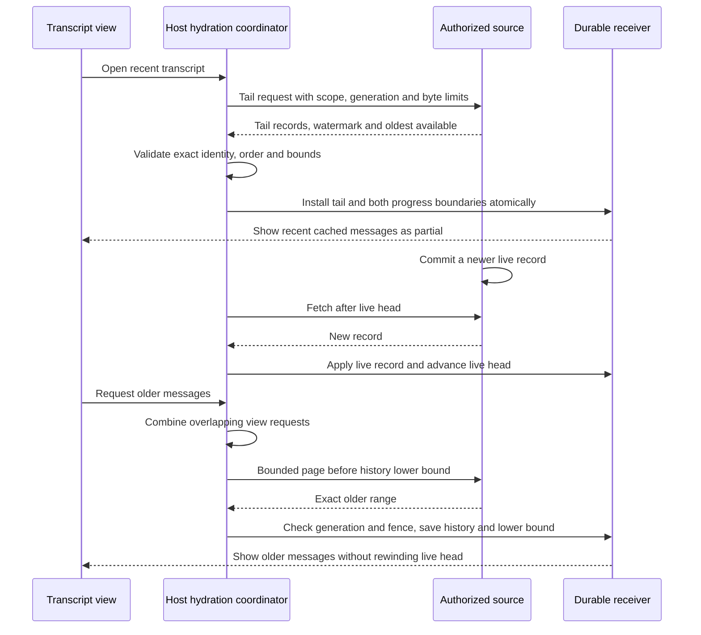

# Slice 5: bounded tail and older history

## Decision

Opening a long transcript first needs the recent tail, not every old message.
The receiver therefore saves two independent positions for one exact `Scope`:

- **Live head** is the last contiguous record applied for ongoing replication.
  `begin_pass` resumes after it. It never decreases during ordinary sync.
- **History lower bound** is the first saved record in the contiguous tail.
  Backfill can decrease it by adding older records. It never changes the live
  head or replays old messages as current lifecycle changes.

An explicit snapshot generation identifies a reset attempt. Source responses
echo the exact scope, generation, request bounds and record identities. A local
deletion fence survives attempted resets and rejects all outstanding responses.
Source pruning is a read boundary, not a reason to skip missing records. If the
source cannot supply the range needed by this snapshot, return `ResetRequired`.

## Contracts

| Owner | Contract |
| --- | --- |
| Tail source | In one short read snapshot, capture committed watermark `H`, oldest readable position `A`, and a contiguous bounded suffix `[L,H]`, with `A <= L`. An empty stream has `H=0` and no records. Never hold the database read transaction while sending bytes over a link. |
| Tail validator | Refuse foreign scope/generation, skipped or repeated positions, mismatched request echo, record IDs, decoded count/byte limits, `L < A`, or a suffix not ending at `H`. No store effect follows refusal. |
| Tail installer | In one transaction save records, live head `H`, lower bound `L`, scope and generation. Refuse a lower watermark than current live progress, an older generation, incompatible schema/incarnation/epoch, or a deletion fence. A retry under the same generation is safe only if it cannot replace newer progress. |
| Live follower | Reuse the existing authorized finite pass from the saved live head. Apply new records and that head atomically. It never derives its position from historical coverage. |
| Older source | Return one bounded contiguous range ending at `before - 1`, with exact scope/generation echo and source pruning floor. If that range is no longer readable, return typed `ResetRequired`; never jump to the available floor. |
| Older installer | In one transaction verify scope, generation, deletion fence and every overlapping record's immutable ID and bytes. Add only the missing contiguous prefix and decrease only the history lower bound. A stale all-overlap reply is an idempotent no-op. A gap or conflicting overlap is refused. |
| View loader | `HistoryReadState` represents unloaded, loading, partial, complete-empty, complete, failed, stale and deleted states. The example host serializes bounded older-page fetches for a scope; `HydrationQueue` coalesces overlapping requests but does not start or schedule network work itself. Local covered reads use no source request. |

The source may retain physical records for append deduplication after it stops
serving them historically. The visible pruning floor is the contract. The
reference SQLite source is illustrative; Nessa's canonical record owner can
implement the same ports without adopting its tables.

## State and ordering table

| State and event | Required result |
| --- | --- |
| No cache, valid tail snapshot | Install `[L,H]` and both boundaries atomically; view is partial if `L>1`, complete if `L=1`, complete-empty if `H=0`. |
| Snapshot reply lost after commit | Reload saved generation/head/lower bound; a repeat is idempotent or stale, never a second lifecycle apply. |
| Snapshot `H` below current live head | Refuse as stale; no replacement or checkpoint rewind. |
| Snapshot generation below saved generation | Refuse even if it has a higher source watermark. |
| New generation snapshot under a deletion fence | Refuse; no resurrection. |
| Schema/incarnation/access epoch differs | Typed incompatibility or reset-required result; no silent replacement. |
| Live record arrives while older page is in flight | Commit live record at the forward head; older page can later add only historical content, leaving that head unchanged. |
| Older page overlaps cached tail or another backfill | Verify exact bytes and IDs; insert only missing prefix. A wholly overlapping identical page does nothing. |
| Older page has a gap or conflicting overlap | Refuse all records and leave both boundaries unchanged. |
| Older reply belongs to superseded generation | Refuse without reading it into the current view. |
| Deletion fence installed during outstanding snapshot/backfill | Erase cached records in the fence transaction; delayed deliveries and future live pages are refused. |
| Source pruning reaches requested missing range | Return `ResetRequired`; keep the verified partial cache and both boundaries. |
| Backfill process exits after a page commit | Restart from durable lower bound. Never replay already saved history as new lifecycle activity. |
| Fifty identical or overlapping requests | Coalesce into the minimum missing lower target, issue only the bounded pages required for coverage, and resolve requests from the local store after commit. |
| Source unavailable during hydration | Keep cached data, show stale/failed request state, and retry from durable coverage on a later explicit wake. |

## Reference implementation evidence

`python3 scripts/verify-slice-5.py` uses a long stream and separate source and
receiver processes. Its first open transfers only a bounded recent tail. It
restarts during older backfill, validates overlap and competing generations with
controlled barriers, tests a permanent deletion fence, injects pruning, and
reports payload bytes, protocol bytes, page reads and both positions. CI runs
the same script. Timing data is local evidence, not a mobile latency promise.
