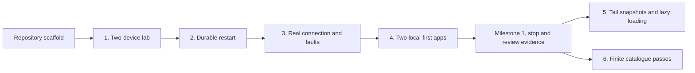

# Implementation plan: verifiable vertical slices

**Status: slice 1 implemented locally; slices 2–6 remain planned.**
The repository contains the bounded record core and independent CI for
[slice 1](https://github.com/nessalabs/sync-engine/issues/2). Do not infer durable
restart or real transport guarantees from its in-memory adapter. [Issue #1](https://github.com/nessalabs/sync-engine/issues/1) tracks the
work. The [ADR](adr/1-reusable-local-first-sync-engine.md) and
[detailed target contract](design/sync-engine.md) were moved from Nessa.

## Outcome we are building toward

An app opens its saved data immediately. One device can disconnect while another
keeps receiving changes. The disconnected device later catches up from its own
saved progress, without downloading unchanged record payloads or repeating actions.
The same core serves a transcript app and a task-board app whose payloads differ.

Reading a cached screen requires no remote record fetch. Small head checks,
notifications, authentication and connection maintenance still consume network.
Initial loading, uncached ranges and compatible recovery snapshots also transfer
data. Measure **record payload bytes separately from protocol bytes**. Zero new
records is not a claim of zero total network traffic.

## Milestones and stopping points

| Slice | Starts with | Independently verifiable end | GitHub |
| --- | --- | --- | --- |
| 1. Bounded replication | Empty library scaffold | A deterministic source/two-device lab converges and rejects invalid batches | [#2](https://github.com/nessalabs/sync-engine/issues/2) |
| 2. Durable replicas | Slice 1 | Separate process restart recovers transcript and checkpoint from SQLite | [#3](https://github.com/nessalabs/sync-engine/issues/3) |
| 3. Real connection | Slice 2 | Source server and two receiver processes converge through dropped hints and weak links | [#4](https://github.com/nessalabs/sync-engine/issues/4) |
| 4. Two applications | Slices 2 and 3 | Transcript and task-board views demonstrate cached reads, stale state and small updates | [#5](https://github.com/nessalabs/sync-engine/issues/5) |
| 5. Load only needed history | Milestone 1 | Long transcript opens from a bounded tail and safely fetches older pages | [#6](https://github.com/nessalabs/sync-engine/issues/6) |
| 6. Changing catalogue | Milestone 1 | A continuously changing list completes finite passes and recovers interruptions | [#7](https://github.com/nessalabs/sync-engine/issues/7) |

**Milestone 1 ends after slice 4.** It proves a reusable durable replication core
and two example apps over actual transport. Slices 5 and 6 form a later milestone
for the larger data sets and list contracts required by Nessa. Pairing, remote
command admission, encrypted relays, Nessa adapters and backups remain separate
integration work. None blocks building the core and examples.



## How each slice is delivered

Each issue is a vertical deliverable, including its contract changes, implementation,
example, failure tests, documentation and CI evidence. Do not make separate domain,
transport and UI PRs that each require unfinished work to demonstrate their purpose.
A slice may have several commits. Keep one bounded deliverable reviewable at a time.

1. Read its starting point and the relevant sequence/state table in the
   [walkthrough](design/core-walkthrough.md).
2. Define any new states, identities and orderings before adding behavior.
3. Implement the smallest path through core, adapter and runnable example.
4. Add a checked-in `scripts/verify-slice-N` runner using the appropriate language.
   Its README command is the same command CI runs. The runner exits nonzero on
   failure and outputs structured observations and counters.
5. Prove the failure rows as well as the happy path. Use deterministic gates and
   fault injection at real adapter boundaries; avoid timing-only assertions.
6. Run formatting, lint, tests, Rustdoc and the slice runner on the final tree.
   Check a core build with optional infrastructure disabled.
7. Review the diff against the contracts, fix findings and record limitations.
   Open the implementation PR against its GitHub issue. Stop at its stated finish
   line. Update its status only when the published evidence actually passes.

The `verify-slice-N` scripts and example commands are **required outputs of those
issues**. Slice 1 provides `./scripts/verify-slice-1`; later runners do not
exist yet. The root README gives the copyable verification command.

## Slice-specific execution briefs

### 1 — Source to two replicas, with explicit limits

Own `replication/domain`, `replication/application` and test-only/in-memory adapters.
Start with immutable opaque records and host-selected identities. The reusable
library knows no conversation, task, provider or user model. A pure validation
step produces a commit plan; application code coordinates the narrow source,
authorization and replica-store ports. Do not build a universal effect interpreter.

The lab creates a small source, gives two receivers separate stores, catches both
up, leaves one offline, adds changes, and brings it back. A source mutation during
a pass must not move that pass's finish line. Add store failures and malformed
responses. Assert exact data, checkpoint and source-read counts.

**Finish:** a default-feature build runs the lab and all state/order tests without
SQLite, networking, an account, the Nessa repo or credentials.

### 2 — The same behavior survives process restart

Introduce optional SQLite infrastructure and its schema contract. Records and
progress share one transaction; compare-and-swap happens inside that transaction.
An exact repeat is distinguished from conflicting reuse of identity. A failed apply
must not leave a checkpoint without its data. If a commit reply is lost, retry
reloads durable progress before deciding what to request.

The transcript example stores generic records. Its host decoder provides the text
view. Keep the source adapter illustrative: integrating `nessalabs/event-stream`
is an adapter decision, not permission to grow another production event store.
Use bounded source reads and indexed identities. Do not scan or serialize the
whole replica on each appended chunk.

**Finish:** a script starts fresh processes against temporary files, restarts them,
compares output and proves transaction rollback and uncertain-commit recovery.
User-supplied paths must never be deleted by a demo reset.

### 3 — Actual network and recoverable notifications

Add a loopback development server and independently running receivers. The server
checks host policy before source reads. Receiver-selected names or epochs never
serve as credentials. This example needs an explicit local trust setup; production
pairing, TLS and remote exposure are not silently implemented by it.

Notify/fetch is the baseline. Subscribe before catch-up, finish the captured pass,
then recheck the head before waiting. An injected host timer recovers missed hints;
choose intervals by experiment rather than baking a latency claim into the core.
One receiver's request/byte budget must not block another receiver or source writes.

Add a fault harness outside the production core: dropped hints, delay, truncation,
outages, retry and throttled bandwidth. Keep frame limits and decompression limits
separate from decoded-record limits. Separate deterministic correctness assertions
from slower real-time measurement runs.

**Finish:** real processes converge, including when all hints are dropped, and emit
an evidence report with payload/protocol/duplicate bytes, request counts and lag.
An unchanged head transfers zero record payload bytes. Report weak-link profiles
and exclusions without calling them a 99.99% availability proof.

### 4 — Reuse demonstrated in two apps

Build a transcript viewer and a small task board. Each has an authoritative example
source and two receiver identities. A receiver service can host a small browser UI
from its local store; browser-to-localhost traffic is distinct from remote source
traffic in the counters. Keep UI technology light and outside the Rust core.

Task creation, title changes, completion and deletion are host-defined records.
Show record-derived task state and transcript text without adding special cases to
the core. Source mutations are explicit. Receiver views remain read-only in this
milestone; a local draft is labeled pending and cannot masquerade as accepted work.

**Finish:** source online/offline controls, two cached views, freshness and byte
counters make the test scenarios inspectable. The test runner also asserts their
outcomes without relying on screenshots. Cached navigation, restart and one-record
updates are measured. No field/property autosave, generic merge or agent execution
is implied by these examples.

### 5 — Large history and hydration

This changes the record recovery contract, so settle snapshot bounds, reset
ownership, pruning and historical range identity first. Live catch-up and historical
backfill maintain different progress. A historical page cannot rewind live state.
A snapshot must be compatible with its tail deltas; delayed reset/backfill replies
must not overwrite newer state or pass deletion/scope fences.

The host read model distinguishes unloaded, loading, partial, complete-empty,
failed and stale data. Coalesce duplicate/overlapping reads with bounded queues.
Prefetch is optional and metered-network aware, rather than mandatory background
loading. Protect pending local data and fences during schema/reset changes.

**Finish:** a long-history example transfers only a recent tail at startup, safely
loads older pages after restart, and exposes deterministic request-count evidence
for overlapping hydration. Implementing safe fences is part of this slice, not
something a test may assume from a future auth integration.

### 6 — A list that keeps changing while it is downloaded

Catalogue replication is not transcript history. Use current entry values with
per-entry revisions, retained deletion markers and a stable paging order. A pass
captures a boundary and finishes even when current values advance beyond it. The
next pass picks up changes, including changes behind the cursor.

Resolve payloads before page progress commits. Full-reset absence classification,
auth epochs, tombstones and response generation are explicit contracts. Do not
infer deletion from a partial pass or archived/missing-summary presentation state.

**Finish:** continuous churn, changed/deleted payloads, interrupted pages and stale
responses all have direct tests. The list finishes a pass rather than repeatedly
starting over. Record bytes, unchanged manifest bytes and request overhead separately.

## Code organization and dependencies

Suggested initial shape, filled only as each slice needs it:

```text
src/replication/
  domain/          identities, bounds, batch validation, scheduling decisions
  application/     one-page catch-up and injected ports
  infrastructure/  optional reference adapters
examples/          host-specific transcript and task-board applications
scripts/           end-to-end verification runners
```

Module maps explain arrow direction and ownership. Test modules follow the same
feature/layer vocabulary. The default library dependency graph excludes product
models, Nessa, provider SDKs, UI frameworks and optional databases/transports.
The host owns clocks, credentials, policy, transport lifecycle and retry scheduling.
Use typed errors and immutable value objects. Do not introduce empty abstraction
layers or a global service locator.

Dependency versions and the minimum supported Rust version must be verified when
introduced. The scaffold's Rust 1.85 floor is checked in CI. Do not silently raise it
to accommodate an example dependency. The development adapter's durability claim
is limited to its demonstrated transaction/restart guarantees; storage hardware
failure and production transport security need their own evidence.

## CI isolation

This repository has its own workflow, lockfile and build cache. No workflow change
is made in `nessa-agent`, and no dependency from that repo is added by this work.
GitHub-hosted runner capacity and organization quotas may still be shared.

The workflow checks slice 1 behavior through its lab and tests. Each implementation
slice adds its behavioral gate to the existing job where practical. Add OS jobs
when a real filesystem/process adapter needs platform coverage. A later Nessa
integration pins a reviewed version and runs its own adapter compatibility tests;
core commits must not automatically advance that dependency.

## Handoff to Sol medium

- Repository: `https://github.com/nessalabs/sync-engine` (public).
- Worktree: `/Users/nessa/Documents/NessaLabs/sync-engine-core`.
- Setup branch: `codex/1-sync-core`, based on the standalone repository.
- Main tracker: #1. First implementation issue: #2.
- Read this plan, the walkthrough and CONTRIBUTING before coding.
- Begin with slice 1 and finish its lab, tests and evidence before moving onward.
- This original handoff predates slice 1. Its current evidence is the checked-in
  two-device lab, failure tests, and CI command.
